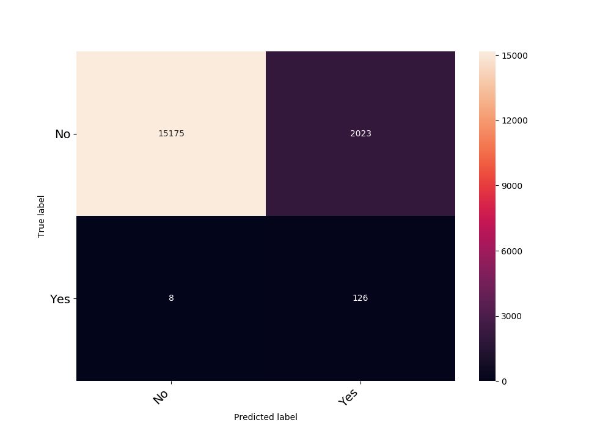
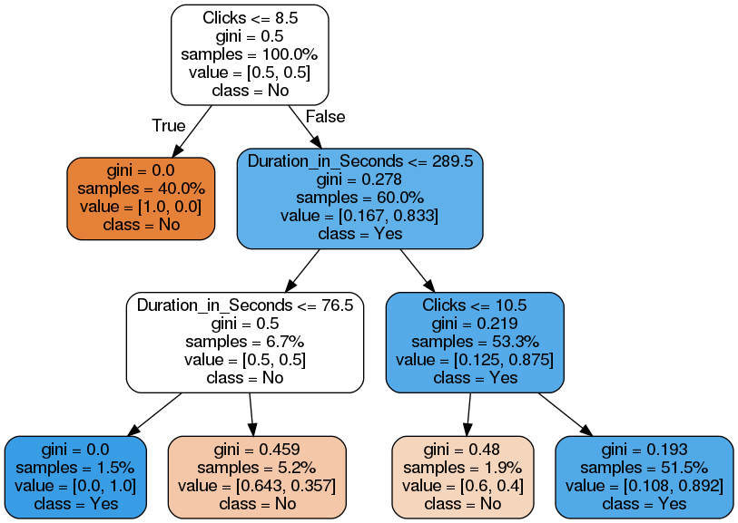

<!--centers the text, but does not work very fine -->
<!-- <style>body {text-align: justify}</style> -->

```{r importingMyLibraries, echo=F, results = "hide", message=F, warning=F}
#    ^ only output, not coding
#cmd+alt+i --> for r coding
#load libraries
library(diffobj)
library(gridExtra)
library(dplyr)
library(janitor)
library(ggplot2)
library(ineq)
library(chron)
library(maps)
library(tidyr)
library(plyr)
library(ggrepel)
library(knitr)
library(stringr)
library(reticulate)
library(pander)
library(kableExtra)
library(infer)
library(maps)

#function for reading csv and plotting it as table
knitTable <- function(path){
  df =  read.csv(file=path)
  kable(df, row.names = FALSE) %>%
    kable_styling(bootstrap_options = c("striped", "hover", "bordered"))
}

#declare python version to use (Comment Kim: I need this to knit the document.)
use_python('/anaconda3/bin/python', required = FALSE)
```

```{r ref.label="sourceCode",echo=FALSE}
 # execute sourceCode chunk from appendix for plotting functions
```

# About the Data {#data}

The available data comes from an online shop, which sells beauty products. There are two datasets given: One with data about customer orders and another with data about customer clicks on the website.

The orders dataset consists of one row for each customer order in the time periode from the 28. January 2000 to the 3. March 2000. The data contains values such as the number of product units ordered, the total order amount, payment information, the manufacturer and brand names of the ordered products and social data about the customer, as by example his location or age.

The clicks dataset contains data referring to customer clicks on the website of the given company. Therefore, it is composed of data such as the timestamp of a click, the session length and the name of the clicked product, as well as the product category it belongs to. In this way the whole session course of a customer can be illustrated through the data.

Both datasets share a considerable amount of columns. However, since not every click results in an order and since a session consists normally of more than one click, the contents differ significantly.

<!-- ---------------------------------------------------------------------------------------------------------------------------------- -->
<!-- ---------------------------------------------------------------------------------------------------------------------------------- -->

# Task Description {#task}

The project's task is to analyze the dataset, especially by creating plots and statistical tables for the data, that is suspected to be relevant for the online shop in some way. 

In addition to that the performance of different Recomendation systems has to be analyzed.

<!-- TODO: Task description of the modelling task -->
Finally, a model has to be constructed to predict whether or not a user of the web-shop will order something, based on his browsing behaviour on the site.

<!-- ---------------------------------------------------------------------------------------------------------------------------------- -->
<!-- ---------------------------------------------------------------------------------------------------------------------------------- -->

# Cleaning the Data {#cleaning}

Before we started cleaning the data, we copied it to the folder "0 Data". The reason for this was to avoid accidentally altering the original dataset by separating the edited datasets from the original ones. The cleaned data and further forms of the datasets were also saved to this folder. Before explaining the cleaning process, it makes sense to get an overview of the content of the aforementioned folder. It can be described as follows:

* Each file has a suffix depending on what language was used for creating it. Files created with a Python script have the suffix "_P", while files created with R have the suffix "_R". 
* For both datasets three types of files are created: 
    + A copy of the original dataset (e.g. "order_data_R.csv")
    + A cleaned version of that dataset (e.g. "order_data_cleaned_R.csv")
    + A smaller version of the cleaned data, which allows quick viewing and testing of the technical functionality of the coding (e.g. "order_data_small_R.csv")

<!-- TODO: Task description of the modelling task -->

<!-- ---------------------------------------------------------------------------------------------------------------------------------- -->
<!-- ---------------------------------------------------------------------------------------------------------------------------------- -->

## Cleaning with R
    
The cleaning process consists of the following steps:

1. Copy the original datasets to the folder "0 Data"

```{r copyFiles, eval=F, echo=F, results = "hide"}
# Path of original file
pathOrders <- "orders/order_data.csv"
# Path of original file to be pasted into the Data folder
newPathOrders <- "0 Data/order_data_R.csv"
# Path of the cleaned file
pathOrdersClean <- "0 Data/order_data_cleaned_R.csv"
# Path of the small version of the clean file
pathOrdersSmall = "0 Data/order_data_small_R.csv"
# Path of the headers
pathOrderHeaders <- "orders/order_columns.txt"

pathClicks <- "clickstream/clickstream_data.csv"
pathClicks2 <- "clickstream/clickstream_data_part_2.csv"
newPathClicks <- "0 Data/clickstream_data_R.csv"
newPathClicks2 <-"0 Data/clickstream_data_part_2_R.csv"
pathClicksClean  <- "0 Data/clickstream_data_cleaned_R.csv"
pathClicksSmall = "0 Data/clickstream_data_small_R.csv"
pathClicksHeaders <- "clickstream/clickstream_columns.txt"

# 1) Copy csv to data folder
file.copy(pathClicks, newPathClicks, overwrite = TRUE )
file.copy(pathClicks2, newPathClicks2, overwrite = TRUE )
file.copy(pathOrders, newPathOrders, overwrite = TRUE )
pathOrders <- newPathOrders
pathClicks <- newPathClicks
pathClicks2 <- newPathClicks2
```

2. Read the data, add headers (i.e. column labels), replace "?" and "NULL" with NA, drop columns which have a 100% ratio of missing data, reformat datetime cells and save the result (e.g. as "order_data_cleaned_R.csv")

```{r cleanFiles, eval=F, echo=F, results = "hide"}
# 2) read files, set headers and replace ? with NA

# Function to get headers from header.txt
getHeaders = function(filepath) {
    headers <- list()
    i <-1
    con <- file(filepath, "r")
    while ( TRUE ) {
        line <- readLines(con, n = 1)
        header <- gsub(":.*$","",line)
        if ( length(line) == 0 ) {
            break
        }
        headers[[i]] <- header
        i <- i+1
    }
    close(con)
    return(headers)
}

# get headers in an array
orderHeaders <- getHeaders(pathOrderHeaders)
clickHeaders <- getHeaders(pathClicksHeaders)

# read files, set headers, replace ? with NA and reformat time and date
orders <- read.csv(file=pathOrders, header=FALSE)

orders[orders=="?"]<-NA
orders[orders=="NULL"]<-NA
colnames(orders) <- orderHeaders
# drop columns which have only NA values
orders <- orders[,colSums(is.na(orders))<nrow(orders)]
# reformate date and time
for (col in names(orders)){
  if (grepl("Time",col)==TRUE){
    orders[,col]=gsub("\\\\", "", orders[,col])
  }
}
# save as new csv
write.table(orders, file = pathOrdersClean, sep=",", row.names=FALSE)

clicks <- read.csv(file=pathClicks, header=FALSE)
clicks2 <- read.csv(file=pathClicks2, header=FALSE)
clicks <- rbind(clicks,clicks2) 
clicks[clicks=="?"]<-NA
clicks[clicks=="NULL"]<-NA
colnames(clicks) <- clickHeaders
clicks <- clicks[,colSums(is.na(clicks))<nrow(clicks)]
for (col in names(clicks)){
  if (grepl("Time",col)==TRUE){
    clicks[,col]=gsub("\\\\", "", clicks[,col])
  }
}
write.table(clicks, file = pathClicksClean, sep=",", row.names=FALSE)
```

3. Create a subset of the cleaned data, containing only 1000 rows, and save it (e.g. as "order_data_small_R.csv")

```{r smallFiles, eval=F, echo=F, results = "hide"}
# 3) Save smaller versions for readability and dev purposes
small_size = min(1000,nrow(orders))
orders_small = orders[1:small_size,]
write.table(orders_small, file = pathOrdersSmall, sep=",", row.names=FALSE)

small_size = min(1000,nrow(clicks))
clicks_small = clicks[1:small_size,]
write.table(clicks_small, file = pathClicksSmall, sep=",", row.names=FALSE)
```
<!-- ---------------------------------------------------------------------------------------------------------------------------------- -->

## Cleaning with Python 

A similar cleaning process to the one explained above has been implemented in Python.

*Note: Python coding chunks are excutable in RMarkdown in general, but the Python environment is not persistent across different python chunks for the preview function ro run coding. Despite this, the chunks are compiled together, when the document is knitted.*
*To execute the provided Python code copy it into the Python IDE of your choice, ideally under the recommended location, which is mentioned at the top of code block. The path is always relative to the repository.*

```{python pythonCleaning, eval=F, echo=F, results = "hide"}
#Recommended Location: "./"

import shutil
import pandas as pd
 
#paths
pathOrders = "orders/order_data.csv"
newPathOrders = "0 Data/order_data_P.csv"
pathOrdersClean = "0 Data/order_data_cleaned_P.csv"
pathOrdersSmall = "0 Data/order_data_small_P.csv"
pathOrdersHeaders = "orders/order_columns.txt"
 
pathClicks = "clickstream/clickstream_data.csv"
pathClicks2 = "clickstream/clickstream_data_part_2.csv"
newPathClicks = "0 Data/clickstream_data_P.csv"
pathClicksClean = "0 Data/clickstream_data_cleaned_P.csv"
pathClicksSmall = "0 Data/clickstream_data_small_P.csv"
pathClicksHeaders = "clickstream/clickstream_columns.txt"

#null values
nan = float('nan')

def headers(path):
    headers = open(path).\
              read().\
              split("\n")
    for counter, header in enumerate(headers):
        headers[counter] = (header.split(":"))[0]
        if not header: #for empty rows
            headers.pop(counter)
    return headers

def clean(df):
    #write NANs, delete empty columns
    df = df. \
         replace(to_replace="?", value=nan). \
         replace(to_replace="NULL", value=nan). \
         dropna(axis=1, how="all")
    #Clean Time and Date
    for column in df.columns:
        if "Time" in column:
            df[column] = df[column].\
                         str.\
                         replace('\\', '', regex=True)
    return df

# Copy files
shutil.copy(pathClicks, newPathClicks)
shutil.copy(pathOrders, newPathOrders)

pathOrders = newPathOrders
pathClicks = newPathClicks

# Read headers
clicksHeaders = headers(pathClicksHeaders)
ordersHeaders = headers(pathOrdersHeaders)

# Read data
clicks = pd.read_csv(pathClicks, sep=",", names=clicksHeaders, dtype=str, encoding="ISO-8859-1")
clicks2 = pd.read_csv(pathClicks2, sep=",", names=clicksHeaders, dtype=str, encoding="ISO-8859-1")
clicks = clean(clicks.append(clicks2))
orders = clean(pd.read_csv(pathOrders, sep=",", names=ordersHeaders, dtype=str, encoding="utf-8"))

# Save to CSV
clicks.to_csv(path_or_buf=pathClicksClean, index=False, encoding='utf-8')
(clicks.head(1000)).to_csv(path_or_buf=pathClicksSmall, index=False, encoding='utf-8')
orders.to_csv(path_or_buf=pathOrdersClean, index=False, encoding='utf-8')
(orders.head(1000)).to_csv(path_or_buf=pathOrdersSmall, index=False, encoding='utf-8')
```
<!-- ---------------------------------------------------------------------------------------------------------------------------------- -->

## Cleaning differences of Python and R {#diff}
To test if the cleaning scripts in Python and R result in the same file, execute the following code in RStudio. The package creates a diff view 

```{r diffFiles, eval=F}
library(diffobj)
pathOrders <- "0 Data/order_data_cleaned_R.csv"
pathClicks  <- "0 Data/clickstream_data_cleaned_R.csv"
pathOrdersPython <- "0 Data/order_data_cleaned_P.csv"
pathClicksPython  <- "0 Data/clickstream_data_cleaned_P.csv"

orders <- read.csv(file=pathOrders)
clicks <- read.csv(file=pathClicks)
clicksP = read.csv(file=pathClicksPython,na.strings=c("","NA"))
diffPrint(target=clicksP,current=clicks)
ordersP = read.csv(file=pathOrdersPython,na.strings=c("","NA"))
diffPrint(target=ordersP,current=orders)
```

<!-- ---------------------------------------------------------------------------------------------------------------------------------- -->

## Merging 
*Note: Since we do not use the merged datasets for any in-depth analysis we consider it to be a part of "Data exploration", instead of "Data cleaning". Thus we implemented it in Python only.*

Furthermore, we tried to merge the click and order data in Python by trying different ID combinations that occure in both datasets. For testing the different combinations we used an inner join in order to be able to recognize easier whether a merging try had success. We tried the following combinations for merging the two datasets, which resulted in the shown shapes for the merged dataset:

```{python pythonMergingTries, eval=F, echo=F}
#Recommended Location: "./"

import pandas as pd

pathIds = '1 Data Preprocessing/mergeIDs.csv'
pathOrders = '0 Data/order_data_cleaned_P.csv'
pathClicks = '0 Data/clickstream_data_cleaned_P.csv'

clicks = pd.read_csv(pathClicks, sep=",", dtype=str)
orders = pd.read_csv(pathOrders, sep=",", dtype=str)
ids = pd.read_csv(pathIds, sep=",", dtype=str)

shapes = []
for index, row in ids.iterrows():
    # Merging
    mergedData = pd.merge(clicks, orders, how='inner', left_on=[row['Clicks']], right_on=[row['Orders']])
    shapes.append(str(list(mergedData.shape)))
ids['Shape'] = shapes
```

```{r MergingTries, echo=F}
path <- '1 Data Preprocessing/mergeIDs.csv'
mergingTries <- read.csv(file=path)
kable(mergingTries, row.names = FALSE)
```

<br> 
In this way we were able to discover that it is possible to join on the 'Customer ID' for some instances. Thus, we saved a dataset for the merging results on the Customer ID. But the merged data makes rather less sense since a Customer ID can have multiple order and click rows. Because of this issue, we decided on building a second, smaller data subset containing only the customer information columns of both original datasets. The final merged customer dataset contains 80 attributes for 97 customers. 

```{python pythonMerging, eval=F, echo=F, results = "hide"}
#Recommended Location: "./1 Data Preprocessing/Python/"

import pandas as pd

# sources
pathOrders = '../../0 Data/order_data_cleaned_P.csv'
pathClicks = '../../0 Data/clickstream_data_cleaned_P.csv'

pathClickCustomer1 = '../../4 Data Overview/Tables/ ClickstreamDataCustomer_Factors.csv'
pathClickCustomer2 = '../../4 Data Overview/Tables/ ClickstreamDataCustomer_Numerical.csv'
pathOrderCustomer1 = '../../4 Data Overview/Tables/ CustomerData_Factors.csv'
pathOrderCustomer2 = '../../4 Data Overview/Tables/ CustomerData_Numerical.csv'

# results
pathMerge = "../../0 Data/merged_P.csv"
pathCustomers = "../../0 Data/merged_Customers_P.csv"

#############################################################################
# normal merge

# read data
clicks = pd.read_csv(pathClicks, sep=",", dtype=str)
orders = pd.read_csv(pathOrders, sep=",", dtype=str)

# merging
mergedData = pd.merge(clicks, orders, how='inner', left_on=['Customer ID'], right_on=['Customer ID'])

# save data
print(list(mergedData.shape))
mergedData.to_csv(path_or_buf=pathMerge, index=False)

#############################################################################
# customer data merge

# read data
clickCustomer1 = pd.read_csv(pathClickCustomer1, sep=",", dtype=str)
clickCustomer2 = pd.read_csv(pathClickCustomer2, sep=",", dtype=str)
orderCustomer1 = pd.read_csv(pathOrderCustomer1, sep=",", dtype=str)
orderCustomer2 = pd.read_csv(pathOrderCustomer2, sep=",", dtype=str)

# build subset on Customer Columns
clickCustomer1 = [w.replace('.', ' ') for w in clickCustomer1['Variable']]
clickCustomer1 = [w.replace('   ', '\. ') for w in clickCustomer1]
clickCustomer2 = [w.replace('.', ' ') for w in clickCustomer2['Variable']]
clickCustomer2 = [w.replace('   ', '\. ') for w in clickCustomer2]
clickCustomer1.extend(clickCustomer2)
clickCustomer1.append('Customer ID')
clicks = clicks[clickCustomer1]
clicks = clicks.drop_duplicates(subset=['Customer ID'])

orderCustomer1 = [w.replace('.', ' ') for w in orderCustomer1['Variable']]
orderCustomer2 = [w.replace('.', ' ') for w in orderCustomer2['Variable']]
orderCustomer1.extend(orderCustomer2)
orderCustomer1.append('Customer ID')
orders = (orders[orderCustomer1])
orders = orders.drop_duplicates(subset=['Customer ID'])

# merging
mergedCustomer = pd.merge(clicks, orders, how='inner', left_on=['Customer ID'], right_on=['Customer ID'], suffixes=('', '_y'))
mergedCustomer.drop(list(mergedCustomer.filter(regex='_y$')), axis=1, inplace=True) #delete duplicates
print(list(mergedCustomer.shape))
mergedCustomer.to_csv(path_or_buf=pathCustomers, index=False)
```

<!-- ---------------------------------------------------------------------------------------------------------------------------------- -->
<!-- ---------------------------------------------------------------------------------------------------------------------------------- -->

# Analyzing the Data {#analysis}

The aim of the data analysis is to extract information, which is suspected to be valuable to the online shop, and prepare it in a way that makes it easily "digestible". The overview of the information is presented in statistical tables and plots.

<!-- ---------------------------------------------------------------------------------------------------------------------------------- -->

## Missing Data{#missingData}

Before creating overview tables or plots for columns, it makes sense to look which columns actually contain a large quantity of information and which do not. To do a check up on the ratio of filled cells, we created a ranking for both datasets containing column names and the percentage of missing data for each column. Columns with a low percentage of missing data are then preferred in later analysis steps. The first 50 entries in the resulting rankings can be seen in the following two tables (left: Orders, right: Clicks). 

```{r NARanking, echo=F, padding = 10}
pathOrders <- "0 Data/order_data_cleaned_R.csv"
pathClicks  <- "0 Data/clickstream_data_cleaned_R.csv"
pathOrdersPython <- "0 Data/order_data_cleaned_P.csv"
pathClicksPython  <- "0 Data/clickstream_data_cleaned_P.csv"

pathNULLAnalysisOrders <- "2 Data Analysis/NAorders.csv"
pathNULLAnalysisClicks <- "2 Data Analysis/NAclicks.csv"

orders <- read.csv(file=pathOrders)
clicks <- read.csv(file=pathClicks)

# Create a DF to save the column names and appropriate NA percentage values
NAorders <- data.frame(matrix(ncol = 2, nrow = 0))
x <- c("Column_Name", "NA_percentage")
colnames(NAorders) <- x

# Get the NA percentage errors
for (column in names(orders)){
    percentageNA <- round(sum(is.na(orders[,column]))/length(orders[,column]),digits=4)
    NAorders[nrow(NAorders) + 1,] = list(column,percentageNA)
}
# Sort by NA percentage ascending
NAorders <- NAorders[with(NAorders, order(NAorders$NA_percentage)),]
# kable(head(NAorders,50), row.names = FALSE, format = 'latex')

##########################################################################

# Create a DF to save the column names and appropriate NA percentage values
NAclicks <- data.frame(matrix(ncol = 2, nrow = 0))
x <- c("Column_Name", "NA_percentage")
colnames(NAclicks) <- x

# Get the NA percentage errors
for (column in names(clicks)){
    percentageNA <- round(sum(is.na(clicks[,column]))/length(clicks[,column]),digits=4)
    NAclicks[nrow(NAclicks) + 1,] = list(column,percentageNA)
}
# Sort by NA percentage ascending
NAclicks <- NAclicks[with(NAclicks, order(NAclicks$NA_percentage)),]
write.table(NAclicks, file = pathNULLAnalysisClicks, sep=",", row.names=FALSE)
# kable(head(NAclicks,50), row.names = FALSE, format = 'latex')

df <- data.frame(matrix(ncol = 1, nrow = 0))
colnames(df) <- c("|   | ")
for (i in 0:49){
  df[nrow(df) + 1,] = list(" |    | ")
}

knitr::kable(list(head(NAorders,50), df, head(NAclicks,50)), row.names = FALSE, booktabs = TRUE, linesep = " ")
```

<!-- ---------------------------------------------------------------------------------------------------------------------------------- -->

## Structure and Content 

### Order Data 

The order data can be mainly devided into 4 sections:

1) **Customer Data**: For this section we regard all information referring to the customer as an individual. This data contains information such as the customer gender, location, family status and retail activities.
```{r ordersCustomers, echo=FALSE, results = 'asis'}
interestingCustomers <- c("City",
                        "Country",
                        "US.State",
                        "Age",
                        "Marital.Status",
                        "Gender",
                        "Audience",
                        "Truck.Owner",
                        "RV.Owner",
                        "Motorcycle.Owner",
                        "Working.Woman",
                        "Presence.Of.Children",
                        "Speciality.Store.Retail",
                        "Oil.Retail.Activity",
                        "Bank.Retail.Activity",
                        "Finance.Retail.Activity",
                        "Miscellaneous.Retail.Activity",
                        "Upscale.Retail",
                        "Upscale.Speciality.Retail",
                        "Retail.Activity"
                        )
cat("\n")
for (title in interestingCustomers) {
  cat(paste("\t *", title, "\n")) 
}
```

2) **Product Data**: The following data columns describe features of the ordered products.
```{r ordersProducts, echo=FALSE, results = 'asis'}
interestingProducts <- c("StockType",
                        "Manufacturer",
                        "BrandName"
                        )
cat("\n")
for (title in interestingProducts) {
  cat(paste("\t *", title, "\n")) 
}
```

3) **Payment Data**: This sections contains columns which describe the payment methods used by the customers.
```{r ordersPayment, echo=FALSE, results = 'asis'}
interestingPayments <- c("Order.Credit.Card.Brand",
                        "Bank.Card.Holder",
                        "Gas.Card.Holder",
                        "Upscale.Card.Holder",
                        "Unknown.Card.Type",
                        "TE.Card.Holder",
                        "Premium.Card.Holder",
                        "New.Bank.Card"
                        )
cat("\n")
for (title in interestingPayments) {
  cat(paste("\t *", title, "\n")) 
}
```

4) **Order Data**: The order data section contains information describing the order process itself, such as order quantity and price data.
```{r ordersOrders, echo=FALSE, results = 'asis'}
interestingOrders <- c("Order.Line.Quantity",
                        "Order.Line.Unit.List.Price",
                        "Order.Line.Amount",
                        "Spend.Over..12.Per.Order.On.Average",
                        "Order.Line.Day.of.Week",
                        "Order.Line.Hour.of.Day",
                        "Order.Promotion.Code",
                        "Order.Discount.Amount"
                       )
cat("\n")
for (title in interestingOrders) {
  cat(paste("\t *", title, "\n")) 
}
```

### Clickstream Data 

The clickstream data has three main categories:

1) **Customer Data**: The data contains a vast collection of information about customers, reaching from usual informations like age, gender, etc. 
over payment information and finacnial activities to opinions about the shop.
```{r clicksCustomers, echo=FALSE, results = 'asis'}
clicksCustomerInfo <- c("WhichDoYouWearMostFrequent",
                        "YourFavoriteLegcareBrand",
                        "Registration.Gender",
                        "NumberOfChildren",
                        "DoYouPurchaseForOthers",
                        "HowDoYouDressForWork",
                        "HowManyPairsDoYouPurchase",
                        "YourFavoriteLegwearBrand",
                        "WhoMakesPurchasesForYou",
                        "NumberOfAdults",
                        "HowDidYouHearAboutUs",
                        "SendEmail",
                        "HowOftenDoYouPurchase",
                        "HowDidYouFindUs",
                        "City",
                        "US.State",
                        "Year.of.Birth",
                        "Email",
                        "Truck.Owner",
                        "RV.Owner",
                        "Motorcycle.Owner",
                        "Value.Of.All.Vehicles",
                        "Age",
                        "Other.Indiv...Age",
                        "Marital.Status",
                        "Working.Woman",
                        "Mail.Responder",
                        "Bank.Card.Holder",
                        "Gas.Card.Holder",
                        "Upscale.Card.Holder",
                        "Unknown.Card.Type",
                        "TE.Card.Holder",
                        "Premium.Card.Holder",
                        "Presence.Of.Children",
                        "Number.Of.Adults",
                        "Estimated.Income.Code",
                        "Home.Market.Value",
                        "New.Car.Buyer",
                        "Vehicle.Lifestyle",
                        "Property.Type",
                        "Loan.To.Value.Percent",
                        "Presence.Of.Pool",
                        "Year.House.Was.Built",
                        "Own.Or.Rent.Home",
                        "Length.Of.Residence",
                        "Mail.Order.Buyer",
                        "Year.Home.Was.Bought",
                        "Home.Purchase.Date",
                        "Number.Of.Vehicles",
                        "DMA.No.Mail.Solicitation.Flag",
                        "DMA.No.Phone.Solicitation.Flag",
                        "CRA.Income.Classification",
                        "New.Bank.Card",
                        "Number.Of.Credit.Lines",
                        "Speciality.Store.Retail",
                        "Oil.Retail.Activity",
                        "Bank.Retail.Activity",
                        "Finance.Retail.Activity",
                        "Miscellaneous.Retail.Activity",
                        "Upscale.Retail",
                        "Upscale.Speciality.Retail",
                        "Retail.Activity",
                        "Dwelling.Size",
                        "Dataquick.Market.Code",
                        "Lendable.Home.Equity",
                        "Home.Size.Range",
                        "Lot.Size.Range",
                        "Insurance.Expiry.Month",
                        "Dwelling.Unit.Size",
                        "Month.Home.Was.Bought",
                        "Available.Home.Equity",
                        "Minority.Census.Tract",
                        "Year.Of.Structure",
                        "Gender",
                        "Occupation",
                        "Other.Indiv...Gender",
                        "Other.Indiv...Occupation"
)
cat("\n")
for (title in clicksCustomerInfo) {
  cat(paste("\t *", title, "\n")) 
}
```
<br>
<br>
2) **Product Data**: The following data columns describe features of products clicked on by the customers.
```{r clicksProducts, echo=FALSE, results = 'asis'}
clicksProducts <- c("BrandName",
                    "UnitsPerInnerBox",
                    "PrimaryPackage",
                    "Depth",
                    "VendorMinREOrderDollars",
                    "Height",
                    "UnitsPerOuterBox",
                    "StockType",
                    "Pack",
                    "ProductForm",
                    "Look",
                    "BasicOrFashion",
                    "MfgStyleCode",
                    "SaleOrNonSale",
                    "Length",
                    "MinQty",
                    "LeadTime",
                    "Weight",
                    "HasDressingRoom",
                    "ColorOrScent",
                    "Width",
                    "Texture",
                    "Manufacturer",
                    "ToeFeature",
                    "Category2",
                    "Material",
                    "CategoryCode",
                    "UnitIncrement",
                    "WaistControl",
                    "Collection",
                    "BodyFeature",
                    "Audience",
                    "Category1",
                    "Product",
                    "Pattern"
)
cat("\n")
for (title in clicksProducts) {
  cat(paste("\t *", title, "\n")) 
}
```
<br>
<br>
3) **Time Data**: The following data columns describe different dates and times for clicks.
```{r clicksTimeinfo, echo=FALSE, results = 'asis'}
clicksTimeInfo <- c("Request.Date",
                    "Request.Date_Time",
                    "Request.Sequence",
                    "REQUEST_DAY_OF_WEEK",
                    "REQUEST_HOUR_OF_DAY",
                    "Cookie.First.Visit.Date",
                    "Cookie.First.Visit.Date_Time",
                    "Session.First.Request.Date",
                    "Session.First.Request.Date_Time",
                    "Session.Start.Login.Count",
                    "Session.Cookie.ID",
                    "Session.ID",
                    "Session.Customer.ID",
                    "Session.Visit.Count",
                    "Session.First.Content.ID",
                    "Session.First.Request.Day.of.Week",
                    "Session.First.Request.Hour.of.Day"
)
cat("\n")
for (title in clicksTimeInfo) {
  cat(paste("\t *", title, "\n")) 
}
```


<!-- ---------------------------------------------------------------------------------------------------------------------------------- -->

## Statistical Tables 

Given a subset of interesting columns, we create two types of statistical tables for each: One table for numerical columns in the subset and another for factors. The statistical table for the numerical data contains the maximum value, minimum value, mean, median and standard deviation for each column. Whereas the factorial tables contain the five most frequent factors as well as their percentage, the ratio of NAs and other factors for each column. For this, the NA percentage gets calculated at first, then the NA values are deleted from the regarded column and the percentage for each value is calcuated.

```{r createSummaryCSVFiles, echo=F, results = "hide", message=F, warning=F}
# create tables as csv to keep the following code chunks small
#-----------------------------------------------------------------------------------
#-----------------------------------------------------------------------------------
# Orders
pathTableFolder <- "./4 Data Overview/Tables/"
#interesting columns are already defined above
#-----------------------------------------------------------------------------------
# order data
subset <- subset(orders, select=interestingOrders)
facCol <- summarizeFactorColumns(subset)
numCol <- summarizeNumericalColumns(subset)
write.table(facCol, file = paste(pathTableFolder,"OrderData_Factors.csv"), sep=",", row.names=FALSE)
write.table(numCol, file = paste(pathTableFolder,"OrderData_Numerical.csv"), sep=",", row.names=FALSE)
#-----------------------------------------------------------------------------------
# payment method
subset <- subset(orders, select=interestingPayments)
facCol <- summarizeFactorColumns(subset)
write.table(facCol, file = paste(pathTableFolder,"PaymentMethodData_Factors.csv"), sep=",", row.names=FALSE)
#-----------------------------------------------------------------------------------
# product data
subset <- subset(orders, select=interestingProducts)
facCol <- summarizeFactorColumns(subset)
write.table(facCol, file = paste(pathTableFolder,"ProductData_Factors.csv"), sep=",", row.names=FALSE)
#-----------------------------------------------------------------------------------
# customer data
subset <- subset(orders, select=interestingCustomers)
facCol <- summarizeFactorColumns(subset)
numCol <- summarizeNumericalColumns(subset)
write.table(facCol, file = paste(pathTableFolder,"CustomerData_Factors.csv"), sep=",", row.names=FALSE)
write.table(numCol, file = paste(pathTableFolder,"CustomerData_Numerical.csv"), sep=",", row.names=FALSE)

#-----------------------------------------------------------------------------------
#-----------------------------------------------------------------------------------
# Clicks
pathTableFolder <- "./4 Data Overview/Tables/"
#-----------------------------------------------------------------------------------
# Clicks
pathTableFolder <- "./4 Data Overview/Tables/"
#-----------------------------------------------------------------------------------
clicksCustomerInfoShort <- c("City",
                        "US.State",
                        "Age",
                        "Marital.Status",
                        "Gender",
                        "Audience",
                        "Truck.Owner",
                        "RV.Owner",
                        "Motorcycle.Owner",
                        "Working.Woman",
                        "Presence.Of.Children",
                        "Speciality.Store.Retail",
                        "Oil.Retail.Activity",
                        "Bank.Retail.Activity",
                        "Finance.Retail.Activity",
                        "Miscellaneous.Retail.Activity",
                        "Upscale.Retail",
                        "Upscale.Speciality.Retail",
                        "Retail.Activity"
)

clicksProductsShort <- c("StockType",
                        "Manufacturer",
                        "BrandName"
                        )

clicksInterestingPayments <- c("Bank.Card.Holder",
                          "Gas.Card.Holder",
                          "Upscale.Card.Holder",
                          "Unknown.Card.Type",
                          "TE.Card.Holder",
                          "Premium.Card.Holder",
                          "New.Bank.Card"
                          )

selectUniqueCustomer <- clicks[ which(clicks$Request.Sequence==1), ]
subset <- subset(selectUniqueCustomer, select=clicksCustomerInfoShort)
facCol <- summarizeFactorColumns(subset)
numCol <- summarizeNumericalColumns(subset)
write.table(facCol, file = paste(pathTableFolder,"ClickstreamDataCustomerShort_Factors.csv"), sep=",", row.names=FALSE)
write.table(numCol, file = paste(pathTableFolder,"ClickstreamDataCustomerShort_Numerical.csv"), sep=",", row.names=FALSE)

subset <- subset(clicks, select=clicksProductsShort)
facCol <- summarizeFactorColumns(subset)
numCol <- summarizeNumericalColumns(subset)
write.table(facCol, file = paste(pathTableFolder,"ClickstreamDataProductsShort_Factors.csv"), sep=",", row.names=FALSE)
write.table(numCol, file = paste(pathTableFolder,"ClickstreamDataProductsShort_Numerical.csv"), sep=",", row.names=FALSE)

subset <- subset(clicks, select=clicksInterestingPayments)
facCol <- summarizeFactorColumns(subset)
write.table(facCol, file = paste(pathTableFolder,"clicksInterestingPayments_Factors.csv"), sep=",", row.names=FALSE)

```

### Order Data 

In the following section the statistical tables generated for the purpose of describing the order data are shown. Additionally, the most important or interesting analysis results are emphasized and shortly explained.

*Note: To support a better visualization, more relevant columns are highligthed in black color.*

#### Customer Data 

Only the age can be regarded as a numerical customer data column here. As most intersting in this summary might appear the mean and the median, which both imply an average customer segment consisting of people in their late 30s.

```{r OrderCustomerNum, echo=FALSE}
knitTable("4 Data Overview/Tables/ CustomerData_Numerical.csv") %>%
  row_spec(1, bold = T, color = "white", background = "#000000")
```

The following data summary shows some social data for the shop's customer segment. Since all of the available data for the country column contains the value 'United States', it is highly probable that the online shop exclusively delivers customer located in the US. This was the reason for us to choose a map of the United States in order to visualize the customers' locations later on in the plotting. Furthermore, the data clearly shows that the main customer audience targeted are women.   

```{r OrderCustomerFac, echo=FALSE}
knitTable("4 Data Overview/Tables/ CustomerData_Factors.csv") %>%
  row_spec(2, bold = T, color = "white", background = "#000000") %>%
  row_spec(5, bold = T, color = "white", background = "#000000") %>%
  row_spec(6, bold = T, color = "white", background = "#000000")
```

#### Product Data 

The selected columns belonging to the product information section show only factorial values. The statistical overview for the product data reveals that most of the sold articles are replenishable. The strongest brand in the current orders is American Essential, which seems to manufacture its articles by itself. Important is to recognize that the presented data is biased in a way: Because the given dataset shows only ordered products, it can be assumed that the popularity of articles distorts all percentual information referring to the products. Thus, we can not make any assumptions referring to the original product palette the store offers.

```{r OrderProductFac, echo=FALSE}
knitTable("4 Data Overview/Tables/ ProductData_Factors.csv") %>%
  column_spec(2, bold = T, color = "white", background = "#000000")
```

#### Payment Data 

When it comes to the data concerning the used payment methods, there are only factorial columns as well. The most used credit card is by far the VISA card. Furthermore almost a fifth of the customers uses a premium card. From this information it could be deduced how wealthy the customer segment is by comparing the ratio of premium cards to the one in the whole population.

```{r OrderPayFac, echo=FALSE}
knitTable("4 Data Overview/Tables/ PaymentMethodData_Factors.csv") %>%
  row_spec(1, bold = T, color = "white", background = "#000000") %>%
  row_spec(8, bold = T, color = "white", background = "#000000")
```

#### Order Process Data 

The numerical data for the order process shows that a customer usally buys one product per order. Also the order line amount implies that the store offers rather inexpensive articles. Furthermore, the minimum value for both the order line quantity and the order line amount is negative, which hints to the assumption of eather the order data containing returns as well or having errors in it. Through the discount amount it is possible to state that the store offers a maximum of a 50% price reduction for the given time period. Also the buyed articles got by average a discount of about 9%. Again it can be assumed that this data is not representative for the shop's offer in general, because it is probable that articles with a higher discount are bought more often.

```{r OrderOrderNum, echo=FALSE}
knitTable("4 Data Overview/Tables/ OrderData_Numerical.csv") %>%
  row_spec(1, bold = T, color = "white", background = "#000000") %>%
  row_spec(3, bold = T, color = "white", background = "#000000") %>%
  row_spec(5, bold = T, color = "white", background = "#000000")
```

The factors for the order process demonstrate that the 'FRIEND' discount is used most often and in the majority of the orders. (At this point it would be relevant for the interpretation to know for whom and under which circumstances this discount is given.) Also the weekday summary could be relevant for sales purposes, by example for finding out the most successfull time for showing ads to possible customers.
```{r OrderOrderFac, echo=FALSE}
knitTable("4 Data Overview/Tables/ OrderData_Factors.csv")  %>%
  row_spec(3, bold = T, color = "white", background = "#000000")
```

<!-- ---------------------------------------------------------------------------------------------------------------------------------- -->

### Clickstream Data 

The following tables resemble only the most important columns from the clickstream dataset. Interesting details are discussed in short texts. For the full range of columns see the [Appendix](#fullClickstreamTables).

#### Customer Data 

The age is very similar to that of the [Order Data](#orderCustomerData), averaging at 37.58, with a median of 36. This shows that buyers do not differ to viewers in respect to their age.

```{r ClicksCustomerFac, echo=FALSE}
knitTable("4 Data Overview/Tables/ ClickstreamDataCustomerShort_Numerical.csv") %>%
  row_spec(1, bold = T, color = "white", background = "#000000")
```

The same can be said in regards to the location compared to the [Order Data](#orderCustomerData), in that there are only minor differences. Additionally, the gender distribution is very similar, heavily pointing out the shop's main target group are women. <br>
*For all details see the [full customer data table](#clicksCustomerFullTable).*

```{r ClicksCustomerNum, echo=FALSE}
knitTable("4 Data Overview/Tables/ ClickstreamDataCustomerShort_Factors.csv") %>%
  row_spec(4, bold = T, color = "white", background = "#000000") %>%
  row_spec(5, bold = T, color = "white", background = "#000000")
```

#### Product Data 

In the clickstream dataset most of the products are only viewed and not bought. That leads to some interesting distinctions to the [Order Product Data](#orderProductData). Seasonal 1* is 10% higher than in the [Order Product Data](#orderProductData) and decreasing the replenishable part with the same amount. Donna Karan is leading the top manufacturer and the top brands, but is closely followed by its competitors. However, when compared to the [Order Product Data](#orderProductData) this company is only in the 4th spot and its product not at all in the top 5, leading to the assumption that customers do not inherently buy that what is most viewed. <br>
*For all details see the [full products data table](#clicksProductsFullTable).*

```{r ClicksProductsFac, echo=FALSE}
knitTable("4 Data Overview/Tables/ ClickstreamDataProductsShort_Factors.csv") %>%
  column_spec(2, bold = T, color = "white", background = "#000000")
```

#### Payment Data

The payment data from the clickstream set is not as reliable, as this kind of information should only be available when purchases were made and so the data should be quite similar to the [Order payment data](#orderPaymentData). Interestingly the data sets differ more than expected, most importantly in the amount of premium cards which is lower by about 5% in the clickstream set, and new credit cards are reported at all.

```{r ClicksPaymentFac, echo=FALSE}
knitTable("4 Data Overview/Tables/ clicksInterestingPayments_Factors.csv") %>%
  row_spec(6, bold = T, color = "white", background = "#000000")
```

#### Calculated Data {#calcData}

Since not all interesting data can be recorded through simply summaring the existing columns, we decided to add calculated columns. The session duration gives the time in minutes a customer spend on the website, which gets calculated through the timestamps on the first and last click of a session. The click number represents how much clicks a customer made during one session. For both these values, the max values indicate that there could be bot activity on the website.

```{r ClicksCalc, echo=FALSE}
knitTable("4 Data Overview/Tables/ ClickstreamData_Calc.csv")
```

<!-- ---------------------------------------------------------------------------------------------------------------------------------- -->

## Plotting 
Some information is too complex to be compressed into a single table without making it too confusing or it's simply easier to understand if presented as a plot. The plot types used are time series plots, stacked bar plots, distribution curves, lorenz curves and maps.

```{r Plotting, echo=FALSE, eval=FALSE, results="hide", message=F, warning=F}
# target path
pathPlotFolder <- "./4 Data Overview/Plots/"

# read mapping table for US states plotting
usStates <- read.csv(file="2 Data Analysis/states.csv")
```

### Order Data 

```{r OrderPlots, echo=FALSE, eval=FALSE, results="hide", message=F, warning=F}
#-----------------------------------------------------------------------------------
#-----------------------------------------------------------------------------------
#Plotting Order Process Data
#-----------------------------------------------------------------------------------
# Distribution of order amount, unit price, order quantity
p1 <- ggplot(orders, aes(x=Order.Line.Amount)) + 
      geom_density() +
      scale_x_continuous(name="Order Line Amount",
                         limits = c(-0.5,45.5),
                         breaks = round(seq(0, 45, by = 3),1)) +
      scale_y_continuous(limits = c(0,0.15)) +
      ggtitle("Distribution of the Order Amount")
p1 <- beautify(p1)

p2 <- ggplot(orders, aes(x=Order.Line.Unit.List.Price)) + 
      geom_density() +
      scale_x_continuous(name="Order Line Unit List Price",
                         limits = c(-0.5,45.5),
                         breaks = round(seq(0, 45, by = 3),1)) +
      ggtitle("Distrubution of the Unit List Price")
p2 <- beautify(p2)

plotData <- data.frame(matrix(ncol = 2, nrow = 0))
x <- c("Date", "Over_12_dollar_percentage")
colnames(plotData) <- x
for (day in orders$Order.Line.Date){
  if (!substring(day,6) %in% plotData$Date){
    subset <- orders %>% filter(Order.Line.Date == day)
    subsetTrue = subset %>% filter(Spend.Over..12.Per.Order.On.Average == "True")
    percentage = round(nrow(subsetTrue)/nrow(subset),2)
    plotData[nrow(plotData) + 1,] = list(substring(day,6),percentage)
  }
}
plotData <- plotData %>% arrange(Date)
plotData$Over_12_dollar_percentage <- plotData$Over_12_dollar_percentage * 100
p3 <- ggplot(data=plotData, aes(x=Date, y=Over_12_dollar_percentage, group=1)) +
  geom_line() +
  geom_point() +
  scale_x_discrete(breaks = c(head(plotData,1)$Date, tail(plotData,1)$Date)) +
  scale_y_continuous(name="Orders over $12 in %")+
  ggtitle("History of Expenses over $ 12 in Percent")
p3 <- beautify(p3)

p4 <- meanOverTime(orders,"Order.Line.Date","Order.Line.Amount","Ø Amount in $") +
      theme_classic() +
      ggtitle("History of Average Order Amount")
p4 <- beautify(p4)

p5 <- meanOverTime(orders,"Order.Line.Date","Order.Line.Unit.List.Price","Ø Price in $") +
      theme_classic() +
      ggtitle("History of Average Unit List Price")
p5 <- beautify(p5)

p6 <- meanOverTime(orders,"Order.Line.Date","Order.Line.Quantity","Ø Quantity") +
      theme_classic() +
      ggtitle("History of Average Order Quantity")
p6 <- beautify(p6)

ggsave(filename=paste(pathPlotFolder,"Order Data Plots/Order Price.png",sep=""),multiplot(p1, p2, p3, p4, p5, p6, cols=2), width=15, height=12)
#-----------------------------------------------------------------------------------
# Distribution of hour of day
beautify(ggplot(orders, aes(x=Order.Line.Hour.of.Day)) +
  geom_density() +
  scale_x_continuous(name="Hour of Day")) +
  ggtitle("Density of Orders over Hour of Day")
ggsave(filename=paste(pathPlotFolder,"Order Data Plots/Order Time.png",sep=""), width=10)
#-----------------------------------------------------------------------------------
# Order Discounts: Distribution of discounts
beautify(ggplot(orders, aes(x=Order.Discount.Amount)) +
  geom_density() +
  scale_x_continuous(name="Discount Amount") +
  ggtitle("Density of Discount"))
ggsave(filename=paste(pathPlotFolder,"Order Data Plots/Order Discounts.png",sep=""), width=10)
#-----------------------------------------------------------------------------------
#-----------------------------------------------------------------------------------
#Plotting product data
#-----------------------------------------------------------------------------------
#Manufacturer lorenz curve
plotBarAndLorenz(orders, "Manufacturer") +
        ggtitle("Lorenz Curve Manufacturers")
ggsave(filename=paste(pathPlotFolder,"Product Data Plots/LorenzManufacturer.png",sep=""), width=12, height=13)
#-----------------------------------------------------------------------------------
#Product ID lorenz curve
plotBarAndLorenz(orders, "Order.Line.Subassortment.ID") +
  ggtitle("Lorenz Curve Products")
ggsave(filename=paste(pathPlotFolder,"Product Data Plots/LorenzProducts.png",sep=""), width=20, height=7)
#-----------------------------------------------------------------------------------
#BrandName lorenz curve
plotBarAndLorenz(orders, "BrandName") +
  ggtitle("Lorenz Curve Brands")
ggsave(filename=paste(pathPlotFolder,"Product Data Plots/LorenzBrandName.png",sep=""), width=12, height=13)
#-----------------------------------------------------------------------------------
#StockPerBrand
top <- orders
top <- table(top$StockType, top$BrandName, useNA="always")
top <- top[, which(colSums(top) != 0)] #drop columns not included in top 10
top <- top[, order(colSums(top), decreasing=TRUE)]
colnames(top)[is.na(colnames(top))] <- 'Others'
rownames(top)[is.na(rownames(top))] <- 'Others'
top <- data.frame(top)
names(top) = c("StockType", "BrandName", "amount")
print(top)
# Stacked Plot
p1 <- ggplot(top, aes(fill=StockType, y=amount, x=BrandName)) + 
  geom_bar( stat="identity") +
  scale_fill_grey() +
  theme_classic() +
  theme(axis.text.x = element_text(angle = 90, hjust = 1, size=centralSize)) +
  ggtitle("Stock Type per Brand")
#StockPerManufacturer
top <- orders
top <- table(top$StockType, top$Manufacturer, useNA="always")
top <- top[, which(colSums(top) != 0)] #drop columns not included in top 10
top <- top[, order(colSums(top), decreasing=TRUE)]
colnames(top)[is.na(colnames(top))] <- 'Others'
rownames(top)[is.na(rownames(top))] <- 'Others'
top <- data.frame(top)
names(top) = c("StockType", "Manufacturer", "amount")
print(top)
# Stacked Plot
p2 <- ggplot(top, aes(fill=StockType, y=amount, x=Manufacturer)) + 
  geom_bar( stat="identity") +
  scale_fill_grey() +
  theme_classic() +
  theme(axis.text.x = element_text(angle = 90, hjust = 1, size=centralSize)) +
  ggtitle("Stock Type per Manufacurer")
ggsave(filename=paste(pathPlotFolder,"Product Data Plots/StockPer.png",sep=""),multiplot(p1, p2, cols=2), width=15)
#-----------------------------------------------------------------------------------
#-----------------------------------------------------------------------------------
#Plotting payment method
#-----------------------------------------------------------------------------------
#CardBrand per
top <- orders
top <- table(top$Premium.Card.Holder, top$Order.Credit.Card.Brand, useNA="always")
top <- top[, which(colSums(top) != 0)] #drop columns not included in top 10
top <- top[, order(colSums(top), decreasing=TRUE)]
colnames(top)[is.na(colnames(top))] <- 'Others'
rownames(top)[is.na(rownames(top))] <- 'No value'
top <- data.frame(top)
names(top) = c("Premium", "CardBrand", "amount")
print(top)
# Stacked Plot
p1 <- beautify(ggplot(top, aes(fill=Premium, y=amount, x=CardBrand)) + 
  geom_bar( stat="identity") +
  theme(axis.text.x = element_text(angle = 90, hjust = 1)) +
  scale_fill_grey() +
  ggtitle("Ratio of Premium Cards per Brand"))
#Upscale Card per Card Brand
top <- orders
top <- table(top$Upscale.Card.Holder, top$Order.Credit.Card.Brand, useNA="always")
top <- top[, which(colSums(top) != 0)] #drop columns not included in top 10
top <- top[, order(colSums(top), decreasing=TRUE)]
colnames(top)[is.na(colnames(top))] <- 'Others'
rownames(top)[is.na(rownames(top))] <- 'No value'
top <- data.frame(top)
names(top) = c("Upscale", "CardBrand", "amount")
print(top)
# Stacked Plot
p2 <- beautify(ggplot(top, aes(fill=Upscale, y=amount, x=CardBrand)) + 
  geom_bar( stat="identity") +
  theme(axis.text.x = element_text(angle = 90, hjust = 1)) +
  scale_fill_grey()+
  ggtitle("Ratio of Upscale Cards per Brand"))
ggsave(filename=paste(pathPlotFolder,"Payment Method Data/CardBrand.png",sep=""),multiplot(p1, p2, cols=2), width=15)
#-----------------------------------------------------------------------------------
#-----------------------------------------------------------------------------------
#Plotting Customer Data
#-----------------------------------------------------------------------------------
# US States heatmap (weighted)
states <- usStates
states$State <- tolower(states$State)
gusa <- map_data("state")
plotData <- merge(orders, states, by.x="US.State", group = group, by.y="Abbreviation")
plotData <-tabyl(plotData$State, sort = TRUE)
names(plotData) <- c("region", "count", "percentage")
print(plotData)
top <- head(arrange(plotData, desc(count)), 10)
top <- top$region
centroids <- summarize(group_by(gusa, region), x = mean(range(long)), y = mean(range(lat))) #Calculate centroids
names(centroids)[1] <- "state"
centroids <- centroids[centroids$state %in% top,]
plotData <- left_join(gusa, plotData)
plotData[is.na(plotData)] <- 0
ggplot(data = plotData, mapping = aes(x = long, y = lat)) +
  geom_polygon(aes(group=group, fill=count), color = "black", size = 0.3) +
  labs(x = NULL, y = NULL, fill = "Count", title = "Customer Hotspots (weighted by order amount)") +
  scale_fill_gradient(low = "white", high = "black") +
  theme(axis.line=element_blank(),axis.text.x=element_blank(),
        axis.text.y=element_blank(),axis.ticks=element_blank(),
        axis.title.x=element_blank(), axis.title.y=element_blank(),
        panel.background=element_blank(),panel.border=element_blank(),panel.grid.major=element_blank()) +
  #geom_label_repel(data = centroids, aes(x, y, label=state), force=2, segment.color="#fd9409", nudge_x=0.5) +
  coord_map()
ggsave(filename=paste(pathPlotFolder,"Customer Data Plots/States_weighted.png",sep=""), bg = "transparent", width=13)

# US States heatmap
states <- usStates
states$State <- tolower(states$State)
gusa <- map_data("state")
ordersDistinctCustomer <- distinct(orders, Customer.ID, .keep_all = TRUE)
plotData <- merge(ordersDistinctCustomer, states, by.x="US.State", group = group, by.y="Abbreviation")
plotData <-tabyl(plotData$State, sort = TRUE)
names(plotData) <- c("region", "count", "percentage")
print(plotData)
top <- head(arrange(plotData, desc(count)), 10)
top <- top$region
centroids <- summarize(group_by(gusa, region), x = mean(range(long)), y = mean(range(lat))) #Calculate centroids
names(centroids)[1] <- "state"
centroids <- centroids[centroids$state %in% top,]
plotData <- left_join(gusa, plotData)
plotData[is.na(plotData)] <- 0
ggplot(data = plotData, mapping = aes(x = long, y = lat)) +
  geom_polygon(aes(group=group, fill=count), color = "black", size = 0.3) +
  labs(x = NULL, y = NULL, fill = "Count", title = "Customer Hotspots") +
  scale_fill_gradient(low = "white", high = "black") +
  theme(axis.line=element_blank(),axis.text.x=element_blank(),
        axis.text.y=element_blank(),axis.ticks=element_blank(),
        axis.title.x=element_blank(), axis.title.y=element_blank(),
        panel.background=element_blank(),panel.border=element_blank(),panel.grid.major=element_blank()) +
  #geom_label_repel(data = centroids, aes(x, y, label=state), force=2, segment.color="#fd9409", nudge_x=0.5) +
  coord_map()
ggsave(filename=paste(pathPlotFolder,"Customer Data Plots/States.png",sep=""), bg = "transparent", width=13)
#-----------------------------------------------------------------------------------
#most important cities (map weighted)
states <- usStates
plotData <- merge(orders, states, by.x="US.State", by.y="Abbreviation")
plotData$name<- with(plotData, paste0(City, " ", US.State)) #new column with city and state
plotData <-tabyl(plotData$name, sort = TRUE)
names(plotData) <- c("name", "count", "percentage")
plotData <- left_join(us.cities, plotData)
plotData <- na.omit(plotData) #drop cities without orders
plotData <- arrange(plotData, desc(count))
cities <- head(plotData, 100)
print(cities)
ggplot() + 
  geom_map(data=map_data("state"), map=map_data("state"), aes(map_id=region),fill="grey", color="white", size=0.15) +
  geom_point(cities, mapping = aes(x = long, y = lat), size=(cities$count)/5, color="black", alpha = .15) +
  geom_text(data=cities,aes(x=long, y=lat, label=name), color = "black", check_overlap = TRUE, size = 3) +
  labs(title = "Top 100 Customer Cities (weighted by order amount)") +
  theme(axis.line=element_blank(),axis.text.x=element_blank(),
        axis.text.y=element_blank(),axis.ticks=element_blank(),
        axis.title.x=element_blank(), axis.title.y=element_blank(),
        panel.background=element_blank(),panel.border=element_blank(),panel.grid.major=element_blank())
ggsave(filename=paste(pathPlotFolder,"Customer Data Plots/Cities_weighted.png",sep=""), width=13)

#most important cities (map)
states <- usStates %>% filter(State != "Alaska") #TODO: Possible bug? Why isn't this bugging the weighted version??
plotData <- merge(ordersDistinctCustomer, states, by.x="US.State", by.y="Abbreviation")
plotData$name<- with(plotData, paste0(City, " ", US.State)) #new column with city and state
plotData <-tabyl(plotData$name, sort = TRUE)
names(plotData) <- c("name", "count", "percentage")
plotData <- left_join(us.cities, plotData)
plotData <- na.omit(plotData) #drop cities without orders
plotData <- arrange(plotData, desc(count))
cities <- head(plotData, 100)
print(cities)
ggplot() + 
  geom_map(data=map_data("state"), map=map_data("state"), aes(map_id=region),fill="grey", color="white", size=0.15) +
  geom_point(cities, mapping = aes(x = long, y = lat), size=(cities$count)/5, color="black", alpha = .15) +
  geom_text(data=cities,aes(x=long, y=lat, label=name), color = "black", check_overlap = TRUE, size = 3) +
  labs(title = "Top 100 Customer Cities") +
  theme(axis.line=element_blank(),axis.text.x=element_blank(),
        axis.text.y=element_blank(),axis.ticks=element_blank(),
        axis.title.x=element_blank(), axis.title.y=element_blank(),
        panel.background=element_blank(),panel.border=element_blank(),panel.grid.major=element_blank())
ggsave(filename=paste(pathPlotFolder,"Customer Data Plots/Cities.png",sep=""), width=13)
#-----------------------------------------------------------------------------------
#age data (weighted)
p1 <- beautify(ggplot(orders, aes(x=Age)) + 
  geom_density() +
  scale_x_continuous(name="Age")) +
  labs(title = "Age Distribution (weighted by order amount)")

plotData <- na.omit(orders %>% select(Age, Gender))
p2 <-beautify(ggplot(plotData) + 
  stat_density(aes(x=Age, linetype=Gender), geom="line", position="identity") +
  labs(title = "Age Distribution per Gender (weighted by order amount)") +
  scale_linetype_discrete(guide=guide_legend(override.aes=aes(colour="black"))))
ggsave(filename=paste(pathPlotFolder,"Customer Data Plots/Age_weighted.png",sep=""), multiplot(p1,p2, cols=2), width=16, height=5)

#age data
p1 <- beautify(ggplot(ordersDistinctCustomer, aes(x=Age)) + 
                 geom_density() +
                 scale_x_continuous(name="Age")) +
  labs(title = "Age Distribution")

plotData <- na.omit(ordersDistinctCustomer %>% select(Age, Gender))
p2 <-beautify(ggplot(plotData) + 
                stat_density(aes(x=Age, linetype=Gender), geom="line", position="identity") +
                labs(title = "Age Distribution per Gender") +
                scale_linetype_discrete(guide=guide_legend(override.aes=aes(colour="black"))))
ggsave(filename=paste(pathPlotFolder,"Customer Data Plots/Age.png",sep=""), multiplot(p1,p2, cols=2), width=16, height=5)
```

#### Customer Data 
The customer data of the order data can be viewed from two perspectives: One way is to use every single order row for the creation of the visualizations and therby create a weighted view on the data, in which customers that have bought more products are more respected. Another possibility is to display the customer information just for every unique customer in the order data and disregard the number of orders a customer made. The following plottings will show both of this perspectives.

Firstly, we genereted some density curves for the attribute age to visualize the distribution of the customership. Also, we differentiated between the genders for this. The curves all show a fast rise in customership for the ages 20 to 40, which decreases slowly after a peak at about 35 to 40. When comparing the weighted and the normal graph, a slightly shift of the curve can be observed. This indicates that in general older people tend to order more. This is especially relevant for an older male customership, which is shown by the peak at about 55 in the male curve of the weighted density plot. Additionally, a less wide peak can be observed for the male customers, which has its maximum shortly before the age of 40. Furthermore, it should be regarded, that the gender plot shows a prozentual curve for each gender, but the ratio of customers differs by gender. 

```{r OrderPlotAge,echo=FALSE}
knitr::include_graphics(rep('./4 Data Overview/Plots/Customer Data Plots/Age_weighted.png', 1))
knitr::include_graphics(rep('./4 Data Overview/Plots/Customer Data Plots/Age.png', 1))
```

In order to show the customer location, we generated a map of the United States, which shows the cities with the highest customer numbers. From this it can be observed that the west coast of the US orders in general the most. The difference between the weighted and the other customer graph shows that the customership from the large cities like New York or San Franscisco tends to have high order numbers since the large circles at this cities disappear, when we look at the non-weighted graph. 

```{r OrderPlotCities,echo=FALSE}
knitr::include_graphics(rep('./4 Data Overview/Plots/Customer Data Plots/Cities_weighted.png', 1))
knitr::include_graphics(rep('./4 Data Overview/Plots/Customer Data Plots/Cities.png', 1))
```

To visualize the importance of different areas, we created a heatmap for the different US States. Here we can see that California and New York are the most important customer states. This is probably highly influenced by the big cities in this states. Here, the distorting factor of population density must be taken into account. 

```{r OrderPlotStates,echo=FALSE}
knitr::include_graphics(rep('./4 Data Overview/Plots/Customer Data Plots/States_weighted.png', 1))
knitr::include_graphics(rep('./4 Data Overview/Plots/Customer Data Plots/States.png', 1))
```

#### Product Data
For the product Data, it has to be regarded that we here visualize the orders and thereby the characteristics of more often bought products have a higher influence. Because of this, the following plots should be seen as popularity graphs of different product attributes.

The following stacked bar plot shows the stock types for the top brands and manufactures. Most of them have a replenishable assortment. The biggest brands and manufacturers seem to have mixed stock types, which contain partly seasonal products. 
```{r OrderPlotStockPer,echo=FALSE}
knitr::include_graphics(rep('./4 Data Overview/Plots/Product Data Plots/StockPer.png', 1))
```


The lorenz curve of the products shows that only a quarter of the whole product quantity is responsible for about 75% of the ordered products. This indicates that some products have a very high popularity.
```{r OrderPlotProducts,echo=FALSE}
knitr::include_graphics(rep('./4 Data Overview/Plots/Product Data Plots/LorenzProducts.png', 1))
```

The manufacturer lorenz curve shows a real high ratio on orders for the biggest manufacturer, which leads to the assumptions that the popularity of some manufacturers is even higher than the product popularity.
```{r OrderPlotManufacturers,echo=FALSE}
knitr::include_graphics(rep('./4 Data Overview/Plots/Product Data Plots/LorenzManufacturer.png', 1))
```

The brand lorenz curve looks a little more flat, indicating a higher relevance for the manufacturer than for the brand.
```{r OrderPlotBrands,echo=FALSE}
knitr::include_graphics(rep('./4 Data Overview/Plots/Product Data Plots/LorenzBrandName.png', 1))
```

#### Payment Data 

The stacked bar plot for credit card brands shows the ratio of each brand on premium and on upscale cards. The card brand AMEX is here noticable with a relative high ratio of premium and upscale cards.
```{r OrderPlotCards,echo=FALSE}
knitr::include_graphics(rep('./4 Data Overview/Plots/Payment Method Data/CardBrand.png', 1))
```

#### Order Process Data 
For the order process data some graphs referring to the order amount and price were created. It has to be respected again that the order data can deform the graphs, by example it is imaginable that the customers tend to buy the cheaper products and therefore the average product price seems lower.

The density curve for the discount amount shows 3 peaks: The first one has a medium height and is around a discount of 0%, the second one is around the 10% mark and is pretty large, whereas the last peak is at a discount of 50% and is rather low. This might indicate that customers buy rather targeted than randomly.
```{r OrderPlotDiscouts,echo=FALSE}
knitr::include_graphics(rep('./4 Data Overview/Plots/Order Data Plots/Order Discounts.png', 1))
```

A density curve reflecting the order time is shown by the next plot. As to be expected the order amount goes down through the night. During the day the ordering is relative stable with some small peaks at 10 a.m. and in the afternoon. The activity in the afternoon can be explained by the average working hours, which mostly allow people only to spend time on online shopping at the afternoon and evening.
```{r OrderPlotTime,echo=FALSE}
knitr::include_graphics(rep('./4 Data Overview/Plots/Order Data Plots/Order Time.png', 1))
```

Next, there is displayed a graph, which summarizes some information on order behaviour. From this visulalization we can learn that the online shop sells products of a low price segments, but usually receives orders contaning a rather high amount (peak at 3-15) of articles. The different history plots on the right indicate a high activity in the first half of February, which drops in the beginning of the second month half and than slowly rises again. The first half could possibly be explained through customers buying presents for the valentines day (14th February).
```{r OrderPlotPrice,echo=FALSE}
knitr::include_graphics(rep('./4 Data Overview/Plots/Order Data Plots/Order Price.png', 1))
```

### Clickstream Data 

Especially interesting for analysing purposes is the time component that comes with the clickstream dataset. Each clickstream consists of timestamps and a number in a sequence.

```{r ClicksPlots, echo=FALSE, eval=FALSE, results="hide", message=F, warning=F}
#-----------------------------------------------------------------------------------
#Plotting
#-----------------------------------------------------------------------------------
#Density Hour of Day
beautify(ggplot(clicks, aes(x=REQUEST_HOUR_OF_DAY)) +
           geom_density() +
           scale_x_continuous(name="Hour of Day")) +
  ggtitle("Density of Clicks over Hour of Day")
#-----------------------------------------------------------------------------------
#Density of time between first and recent click
SeqAndTime <- clicks %>% # select sequence and time
  select("Request.Date_Time", "Request.Sequence")

SeqPos <- 0 # the position in the click sequence
Index <- 1 # current index
FirstVisit <- 1 # position of first click
vector <- character(0) # empty helper vector
clickNum <- vector()
# search for start and and of click sequences and get the matching times
  for (val in SeqAndTime$Request.Sequence) {
    if(val>SeqPos) {
      SeqPos <- val
    }
    if(val<SeqPos) {
      clickNum <- c(clickNum, SeqPos)
      vector <- c(vector, SeqAndTime[FirstVisit, "Request.Date_Time"] %>%
                    as.character())
      vector <- c(vector, SeqAndTime[Index-1, "Request.Date_Time"] %>%
                    as.character())
      FirstVisit <- Index
      SeqPos <- 1
    }
    if(val == SeqPos) {
      clickNum <- c(clickNum, SeqPos)
    }
    Index <- Index+1
  }

vector <- chron(times=vector) # convert the times into chron objects
diffV <- diff(vector) %>%
  as.data.frame # compute the difference between sequential times
diffV <- diffV[seq(1, nrow(diffV), 2), 1] %>%
  as.data.frame # only select every second entry
diffV$hours <- hours(diffV$.) # add columns for hours, minutes and seconds
diffV$minutes <- minutes(diffV$.)
diffV$seconds <- seconds(diffV$.)
diffV$totalMinutes <- diffV$hours*60 + #calculate the total minutes
  diffV$minutes +
  diffV$seconds/60
calc <- data.frame("Session Duration" = diffV$totalMinutes)
clickNum <- data.frame("Click Number" = clickNum)
diffV <- subset(diffV, totalMinutes<40) # only select rows with less than 40 mins
                                        # for visual reasons

# plot the data
beautify(ggplot(diffV, aes(totalMinutes)) +
  geom_density() +
  ggtitle("Density of Session Duration (under 40 minutes)"))
#-----------------------------------------------------------------------------------
#History of Clicks
hourGroup <- clicks %>%
  select(Request.Date, REQUEST_HOUR_OF_DAY)
hourGroup <- add_count(hourGroup, sort = FALSE, name = "count")

hourGroup$datetime <- paste0(hourGroup$REQUEST_HOUR_OF_DAY, ":00:00")
hourGroup$datetime <- paste(hourGroup$Request.Date, hourGroup$datetime)
hourGroup$datetime <- as.POSIXct(hourGroup$datetime, format = "%Y-%m-%d %H:%M:%S")  
   
beautify(ggplot(hourGroup, aes(x = datetime, y=count)) +
  geom_line() +
  ggtitle("History of Clicks per Hour"))
#-----------------------------------------------------------------------------------
#-----------------------------------------------------------------------------------
#print calc columns
calcCol <- summarizeNumericalColumns(calc)
calcCol2 <- summarizeNumericalColumns(clickNum)
calcCol <- rbind(calcCol, calcCol2)

write.table(calcCol, file = paste(pathTableFolder,"ClickstreamData_Calc.csv"), sep=",", row.names=FALSE)
```

#### Click time per Day

Most of the licks are accumulated in the morning and then descending over day. The extreme spike at around 2 in the morning can be neglected as it seems to be bot activity with extremly long session times and sequences.

```{r ClicksTime, echo=FALSE}
knitr::include_graphics(rep('./4 Data Overview/Plots/Clickstream Data Plots/ClickTime.png', 1))
```

#### Click time overall

The above mentioned behavior is also visible in this graph. Overall there is more activity during the middle of months and less towards the end. Also, the seasonal component of the clickstream data set is visible very well.

```{r ClicksTimeHistory, echo=FALSE}
knitr::include_graphics(rep('./4 Data Overview/Plots/Clickstream Data Plots/ClickHistory.png', 1))
```

#### Session length

While the session length on average is about 8 min, the median only is at about 2 min (see [table](#calcData)). This is visible in the graph where the high point is also at about 2 min indicating the skewness of the time data. Most sessions last only around 10 min, which leads to the assumption that products should be displayed well as the customers do not waste much time on searching for them.

```{r ClicksSessionLength, echo=FALSE}
knitr::include_graphics(rep('./4 Data Overview/Plots/Clickstream Data Plots/SessionDuration.png', 1))
```


<!-- ---------------------------------------------------------------------------------------------------------------------------------- -->
<!-- ---------------------------------------------------------------------------------------------------------------------------------- -->

# Evaluating Recomendation Systems 

In addition to analyzing the order and clickstream data, we have to analyze the performance of different recommendation models. The performance of three different recommendation systems was measured:

* A profit based recommendation system: This one recommends products that shall fit the taste of the subject, but also generate high revenue shares.
* A ranking based recommendation system: This one recommends best performing products according to their sales rank.
* A random recommendation system: This one was used as a baseline treatment.

The evaluation of the profit and ranking based recommendation systems is done using inference analysis, specifically using the computational paradigm instead of the mathematical one. One test for each of the two recommendation systems is carried out with the null hypothesis always being that the system does not cause different sales than a purely random recommendation system. During each test we randomize our sample data 1000 times, using either permutation or bootstrapping, and measure the p-value and confidence interval. The test statistic, we always use, is the difference in mean between the group using the profit or ranking based Recomendation system and the group using the random recommendation system. 
If the null hypothesis was true, then the test statistic value for our sample would not significantly differ from the distribution of the test statistic for our randomized data. Our default alpha for the confidence interval is 5%, but since we conduct a total of two tests, we have to apply the Bonferroni correction and adjust the alpha we specify for our confidence interval to 2.5%.

Before diving into the inference analysis itself, we have to reformat our data for the recommendation systems into a form that is suitable for inference analysis. We want to have a data frame in which one row equals one customer, who was exposed to a recommendation system. We use three columns:

* Sales: The sales in Euro per customer.
* Used_Profit_Oriented_recommendations: 1 if the customer was exposed to the profit oriented recommendation system, otherwise 0.
* Used_Top_recommendations: 1 if the customer was exposed to the ranking based recommendation system, otherwise 0.

If the value in column Used_Top_recommendations and Used_Profit_Oriented_recommendations is 0, it means that the random recommendation system was used.

In the following code block we reformat the data and print the first 10 rows of the reformatted table.

```{r InferenceReformat, echo=FALSE}
pathExperiment <- "experiment/experimental_results.csv"
experiment <- read.csv(file=pathExperiment)

# Reformat the results to allow inference analysis
experimentDf <- data.frame(matrix(ncol = 3, nrow = 0))
x <- c("Sales_in_EUR","Used_Profit_Oriented_recommendations","Used_Top_recommendations")
colnames(experimentDf) <- x

for (row in 1:nrow(experiment)){
  random <- experiment[row, "random_recommendations"]
  profit <- experiment[row, "profit_oriented"]
  top <- experiment[row, "ranking_based"]
  if (!is.na(random)){
    experimentDf[nrow(experimentDf) + 1,] = list(random,0,0)
  }
  if (!is.na(profit)){
    experimentDf[nrow(experimentDf) + 1,] = list(profit,1,0)
  }
  if (!is.na(top)){
    experimentDf[nrow(experimentDf) + 1,] = list(top,0,1)
  }
}

experimentDf[,"Used_Profit_Oriented_recommendations"] <- factor(experimentDf[,"Used_Profit_Oriented_recommendations"])
experimentDf[,"Used_Top_recommendations"] <- factor(experimentDf[,"Used_Top_recommendations"])
experiment <- experimentDf

kable(head(experiment,10), row.names = FALSE) %>%
    kable_styling(bootstrap_options = c("striped", "hover", "bordered"))
```

## The Profit Oriented Recommendation System 

Now, we do an inference analysis for the profit oriented recommendation system. Firstly, we look at the p-value and the corresponding plot:

```{r InferenceProfitP, echo=FALSE}
# Do inference analysis
# Part 1: Test if the profit oriented recommendation system causes a significant difference in sales

obs_stat <- experiment %>% 
  filter(Used_Top_recommendations == 0) %>%
  specify(Sales_in_EUR ~ Used_Profit_Oriented_recommendations) %>%
  calculate(stat = "diff in means", order=c("1","0"))

permuted_stat <- experiment %>% 
  filter(Used_Top_recommendations == 0) %>%
  specify(Sales_in_EUR ~ Used_Profit_Oriented_recommendations) %>%
  hypothesize(null = "independence") %>%
  generate(reps = 1000, type="permute") %>%
  calculate(stat = "diff in means", order=c("1","0"))

p_val <- permuted_stat %>%
  get_p_value(obs_stat = obs_stat, direction = "two_sided")
print(paste("p-value = ",as.data.frame(p_val)[1,1],sep=""))

viz_plot <- permuted_stat %>% visualize()
viz_plot <- viz_plot + shade_p_value(obs_stat, direction = "two_sided", color = "black", fill = "grey")
print(viz_plot)
```

The plot shows us the distribution of the test statistic for the 1000 randomized samples. The test statistic value for our sample is represented by a black line. The two-sided p-value regions are marked by a grey background. If our null hypothesis were true, then the test statistic value of our sample would be somewhere in the distribution of the test statistic for the randomized samples. Every test statistic value for a randomized sample, which lies in the p-value region, increases the p-value.

As we can see the test statistic value of our sample is pretty far away from the test statistic values of the randomized samples. This already shows, without looking at the p-value itself, that the profit oriented recommendation system causes a significant difference in the sales in Euro. The value of the p-value is 0, which reaffirms our interpretation of the plot.

Now, we look at the confidence interval:

```{r InferenceProfitCI, echo=FALSE}
bootstrap_stat <- experiment %>%
  filter(Used_Top_recommendations == 0) %>%
  specify(Sales_in_EUR ~ Used_Profit_Oriented_recommendations) %>%
  generate(reps = 1000, type = "bootstrap") %>%
  calculate(stat = "diff in means", order = c("1", "0"))

# Bonferroni correction: Default alpha = 5%, number of tests = 2 -> Set alpha to 2.5% -> level = 0.95
ci <- bootstrap_stat %>%
  get_confidence_interval(level = 0.95)
kable(ci, row.names = FALSE) %>%
    kable_styling(bootstrap_options = c("striped", "hover", "bordered"))
lowerBound <- round(as.data.frame(ci)[1,1],digits=2)
upperBound <- round(as.data.frame(ci)[1,2],digits=2)

viz_plot <- bootstrap_stat[complete.cases(bootstrap_stat), ] %>% visualize()
viz_plot <- viz_plot + shade_confidence_interval(ci, color = "black", fill = "grey")
print(viz_plot)
```

As we can see, there is a 95% chance that for the global population customers, who get profit oriented recommendations, spend on average `r lowerBound`€-`r upperBound`€ more than people who get random recommendations.

## The Ranking Based Recommendation System 

Now we do an inference analysis for the ranking based recommendation system. Firstly, we look at the p-value and the corresponding plot:

```{r InferenceRankingP, echo=FALSE}
# Part 2: Test if the popular products recommendation system causes a significant difference in sales

obs_stat <- experiment %>% 
  filter(Used_Profit_Oriented_recommendations == 0) %>%
  specify(Sales_in_EUR ~ Used_Top_recommendations) %>%
  calculate(stat = "diff in means", order=c("1","0"))

permuted_stat <- experiment %>% 
  filter(Used_Profit_Oriented_recommendations == 0) %>%
  specify(Sales_in_EUR ~ Used_Top_recommendations) %>%
  hypothesize(null = "independence") %>%
  generate(reps = 1000, type="permute") %>%
  calculate(stat = "diff in means", order=c("1","0"))

p_val <- permuted_stat %>%
  get_p_value(obs_stat = obs_stat, direction = "two_sided")
print(paste("p-value = ",as.data.frame(p_val)[1,1],sep=""))

viz_plot <- permuted_stat %>% visualize()
viz_plot <- viz_plot + shade_p_value(obs_stat, direction = "two_sided", color = "black", fill = "grey")
print(viz_plot)
```

In this plot quite some portions of the distribution of the test statistic for our random samples lie in the p-value zone. This is also shown by the p-value `r as.data.frame(p_val)[1,1]`, which greater than 0.025. This means that for our alpha = 0.05 the effect of the ranking based recommendation system is statistically insignificant.

Now we look at the confidence interval:

```{r InferenceRankingCI, echo=FALSE}
bootstrap_stat <- experiment %>%
  filter(Used_Profit_Oriented_recommendations == 0) %>%
  specify(Sales_in_EUR ~ Used_Top_recommendations) %>%
  generate(reps = 1000, type = "bootstrap") %>%
  calculate(stat = "diff in means", order = c("1", "0"))

# Bonferroni correction: Default alpha = 5%, number of tests = 2 -> Set alpha to 2.5% -> level = 0.95
ci <- bootstrap_stat %>%
  get_confidence_interval(level = 0.95)
kable(ci, row.names = FALSE) %>%
    kable_styling(bootstrap_options = c("striped", "hover", "bordered"))
lowerBound <- round(as.data.frame(ci)[1,1],digits=2)
upperBound <- round(as.data.frame(ci)[1,2],digits=2)

viz_plot <- bootstrap_stat[complete.cases(bootstrap_stat), ] %>% visualize()
viz_plot <- viz_plot + shade_confidence_interval(ci, color = "black", fill = "grey")
print(viz_plot)
```

Since the confidence interval includes the value 0, it shows us that the effect is statistically insignificant.

## Conclusion 

To sum it up, the company should use the profit oriented recommendation system, since out of the two tested systems it causes the largest increase in sales. The ranking based recommendation system does not cause any statistically relevant difference in sales. However if the effect was something else than sales in Euro per person, then the results could be different. The company should ask itself if the goal of their recommendation system should really be to increase sales. Maybe at some point in time it could introduce a subscription business model, similar to that of Amazon. In that case it might also want to increase the percentage of customers that have a subscription.

<!-- ---------------------------------------------------------------------------------------------------------------------------------- -->
<!-- ---------------------------------------------------------------------------------------------------------------------------------- -->

# Predicting customer behaviour {#model}

Following the inference analysis our next task is to predict whether or not a person browsing the online-shop will end up purchasing something, based on the browsing behaviour on the site.

First of all the relevant data had to be extracted, or engineered, from the clickstream data and put into a seperate dataset, to be used as the input data for a prediction model. The resulting data set contains one row per session. For each session the following attributes are used:

* The number of clicks during that session
* The session duration (in seconds)
* The hour of day at which the session was started
* The day of week at which the session was started
* Whether the session contains an order (this was extracted by looking if the customer visited the URL "checkout/thankyou")

```{python prepareModelInputData, eval=F, echo=F, results = "hide"}
#Recommended Location: "./3 Data Modelling/Python/"

import pandas as pd
import datetime
import numpy as np

pathClicks = '../../0 Data/clickstream_data_cleaned_P.csv'
pathResult = "../prediction_input_data.csv"

#############################################################################

# read data
clicksOrig = pd.read_csv(pathClicks, sep=",", dtype=str)

df = pd.DataFrame(columns=['Clicks','Duration_in_Seconds','REQUEST_DAY_OF_WEEK','REQUEST_HOUR_OF_DAY','Ordered'])
clickCount = '1'
minTime = 0
maxTime = 0
ordered = "No"
init = 1
for index, row in clicksOrig.iterrows():
    if row["Request Sequence"] == '1':
        if init == 0 and clickCount != '1':
            duration = (maxTime - minTime).total_seconds()
            df.loc[len(df)] = [str(clickCount), str(duration), str(day), str(hour), str(ordered)]
        if init == 1:
            init = 0
        ordered = "No"
        #new minTime
        dt = row['Request Date'] + ' ' + row['Request Date_Time']
        minTime = datetime.datetime.strptime(dt, '%Y-%m-%d %H:%M:%S')
        day = row["REQUEST_DAY_OF_WEEK"]
        hour = row["REQUEST_HOUR_OF_DAY"]
    if row["Request Template"] == "checkout/thankyou\.jhtml":
        ordered = "Yes"
    clickCount = row["Request Sequence"]
    dt = row['Request Date'] + ' ' + row['Request Date_Time']
    maxTime = datetime.datetime.strptime(dt, '%Y-%m-%d %H:%M:%S')


# one hot encode where needed
df['REQUEST_HOUR_OF_DAY'] = df['REQUEST_HOUR_OF_DAY'].apply(lambda x: "{}{}".format('Hour_', x))
one_hot = pd.get_dummies(df['REQUEST_HOUR_OF_DAY'])
df = df.drop('REQUEST_HOUR_OF_DAY',axis = 1)
df = df.join(one_hot)
df['REQUEST_DAY_OF_WEEK'] = df['REQUEST_DAY_OF_WEEK'].apply(lambda x: "{}{}".format('Weekday_', x))
one_hot = pd.get_dummies(df['REQUEST_DAY_OF_WEEK'])
df = df.drop('REQUEST_DAY_OF_WEEK',axis = 1)
df = df.join(one_hot)
df.to_csv(pathResult, index=False)
```

Since the last two attributes have to be one-hot-encoded, it is not possible to show the head of the dataset in this report. However an important thing to note is that about 99% of sessions do not contain an order. In addition to that, sessions consisting of only one click are ignored, since they offer no valuable information.

After preparing the data the next step is training and testing a model. The model of choice is a decision tree, since it allows to easily understand the decision making process of the model, and since it removes the need for dimensionality reduction and feature scaling, thus reducing the required work. The evaluation metric used during the Grid Search is roc-score. However, depending on the evolving needs of the company, one might want to chose a different evaluation metric.

```{python createTree, eval=F, echo=F, results = "hide"}
#Recommended Location: "./3 Data Modelling/Python/"
#Note: In addition to having the packages installed, the software "graphviz" also needs to be installed. If any bugs related to graphviz prevent you from running the code, you can use the figure provided in this chapter as a reference.

import numpy as np
import pandas as pd

import matplotlib.pyplot as plt
import seaborn as sns

from sklearn.model_selection import train_test_split

from sklearn.metrics import accuracy_score
from sklearn.metrics import recall_score
from sklearn.metrics import roc_auc_score
from sklearn.metrics import confusion_matrix
from sklearn.model_selection import cross_val_score, cross_val_predict
from sklearn.model_selection import GridSearchCV

from sklearn import tree
import graphviz
import pydotplus

import math

pathInput = '../prediction_input_data.csv'
pathConfusionMatrix = "../cm_tree.png"
pathTreeVisualization = "../graphviz_tree.png"

# --------------------------Utility functions--------------------------------
#Methode zum Plotten einer Confusion Matrix
#Quelle: https://gist.github.com/shaypal5/94c53d765083101efc0240d776a23823

def print_confusion_matrix(confusion_matrix, class_names, figsize=(10, 7), fontsize=14):
    """Prints a confusion matrix, as returned by sklearn.metrics.confusion_matrix, as a heatmap.

    Arguments
    ---------
    confusion_matrix: numpy.ndarray
        The numpy.ndarray object returned from a call to sklearn.metrics.confusion_matrix.
        Similarly constructed ndarrays can also be used.
    class_names: list
        An ordered list of class names, in the order they index the given confusion matrix.
    figsize: tuple
        A 2-long tuple, the first value determining the horizontal size of the ouputted figure,
        the second determining the vertical size. Defaults to (10,7).
    fontsize: int
        Font size for axes labels. Defaults to 14.

    Returns
    -------
    matplotlib.figure.Figure
        The resulting confusion matrix figure
    """
    df_cm = pd.DataFrame(
        confusion_matrix, index=class_names, columns=class_names,
    )
    fig = plt.figure(figsize=figsize)
    try:
        heatmap = sns.heatmap(df_cm, annot=True, fmt="d")
    except ValueError:
        raise ValueError("Confusion matrix values must be integers.")
    heatmap.yaxis.set_ticklabels(heatmap.yaxis.get_ticklabels(), rotation=0, ha='right', fontsize=fontsize)
    heatmap.xaxis.set_ticklabels(heatmap.xaxis.get_ticklabels(), rotation=45, ha='right', fontsize=fontsize)
    plt.ylabel('True label')
    plt.xlabel('Predicted label')
    return fig

# Methode zum Entfernen doppelter Blätter
# Quelle: https://stackoverflow.com/questions/51397109/prune-unnecessary-leaves-in-sklearn-decisiontreeclassifier

from sklearn.tree._tree import TREE_LEAF

def is_leaf(inner_tree, index):
    # Check whether node is leaf node
    return (inner_tree.children_left[index] == TREE_LEAF and
            inner_tree.children_right[index] == TREE_LEAF)

def prune_index(inner_tree, decisions, index=0):
    # Start pruning from the bottom - if we start from the top, we might miss
    # nodes that become leaves during pruning.
    # Do not use this directly - use prune_duplicate_leaves instead.
    if not is_leaf(inner_tree, inner_tree.children_left[index]):
        prune_index(inner_tree, decisions, inner_tree.children_left[index])
    if not is_leaf(inner_tree, inner_tree.children_right[index]):
        prune_index(inner_tree, decisions, inner_tree.children_right[index])

    # Prune children if both children are leaves now and make the same decision:
    if (is_leaf(inner_tree, inner_tree.children_left[index]) and
        is_leaf(inner_tree, inner_tree.children_right[index]) and
        (decisions[index] == decisions[inner_tree.children_left[index]]) and
        (decisions[index] == decisions[inner_tree.children_right[index]])):
        # turn node into a leaf by "unlinking" its children
        inner_tree.children_left[index] = TREE_LEAF
        inner_tree.children_right[index] = TREE_LEAF
        ##print("Pruned {}".format(index))

def prune_duplicate_leaves(mdl):
    # Remove leaves if both
    decisions = mdl.tree_.value.argmax(axis=2).flatten().tolist() # Decision for each node
    prune_index(mdl.tree_, decisions)
# --------------------------Utility functions--------------------------------


df = pd.read_csv(pathInput,sep=',',encoding='utf-8')
df.Ordered = df.Ordered.astype('str', copy=False)

subset0 = df.loc[df['Ordered'] == 'Yes']
subset0 = subset0.sample(n=math.ceil(len(subset0.index)/2))
subset1 = df.loc[df['Ordered'] == 'No']
subset1 = subset1.sample(n=math.ceil(len(subset0.index)*2))

train = subset1.append(subset0)
test = df[~df.isin(train)].dropna()

X_train_val = train.drop('Ordered', axis=1)
y_train_val = train.loc[:,'Ordered']
X_test = test.drop('Ordered', axis=1)
y_test = test.loc[:,'Ordered']

classes = ['No','Yes']

parameters = {'max_depth':[1,2,3,4,5],
              'min_samples_leaf':[1,0.0025,0.005,0.01],
              'min_impurity_decrease':[0, 0.05,0.1,0.15,0.2,0.25]}

clf = GridSearchCV(estimator=tree.DecisionTreeClassifier(), param_grid=parameters, scoring ='roc_auc', n_jobs=-1, cv=10)
clf.fit(X_train_val, y_train_val)

print('Best score for data1:', clf.best_score_)
print('Best Depth:',clf.best_estimator_.max_depth)
print('Best Min Samples Leaf:',clf.best_estimator_.min_samples_leaf)
print('Best Min Impurity Decrease:',clf.best_estimator_.min_impurity_decrease)

clf = tree.DecisionTreeClassifier(
    max_depth = clf.best_estimator_.max_depth,
    min_samples_leaf = clf.best_estimator_.min_samples_leaf,
    min_impurity_decrease=clf.best_estimator_.min_impurity_decrease).fit(X_train_val,y_train_val)
prune_duplicate_leaves(clf)
y_predictions = clf.predict(X_test)

cm = confusion_matrix(y_test, y_predictions,classes)
print_confusion_matrix(cm,classes)
plt.savefig(pathConfusionMatrix)
plt.show()


accuracy = round(accuracy_score(y_test, y_predictions),2)
f1 = round(recall_score(y_test, y_predictions, average="binary", pos_label="Yes"),2)
print("Accuracy: "+str(accuracy))
print("F1: "+str(f1))
# Convert y to int for roc scoring
y_test = y_test.replace("No",0)
y_test = y_test.replace("Yes",1)
y_predictions[y_predictions == "No"] = 0
y_predictions[y_predictions == "Yes"] = 1
roc = roc_auc_score(y_test, y_predictions)
print("ROC AUC score: "+str(roc))

dot_data = tree.export_graphviz(clf, out_file=None, feature_names=X_train_val.columns, class_names = clf.classes_,
                                label = 'all', filled = True, leaves_parallel= False, impurity = True, node_ids = False,
                                proportion=True, rotate=False, rounded=True, precision=3)

graph = pydotplus.graph_from_dot_data(dot_data)
graph.write_png(pathTreeVisualization)
```

Since the training set is created by using random samples, model performance can vary during each run. However, on average the accuracy should be around 90%, the F1 score at around 93% and the ROC score at around 95%. Also, on average the most important features are the number of clicks and the session duration. 

The confusion matrix can be seen below. As you can see, the model classifies around 95% of sessions, which contain an order, correctly. However, only around 89% of instances, which do not contain an order, are classified correctly. This brings up the following question: How should each classification type be weighted? To answer this the company should first ask itself "How, if at all, do we want to target session users differently?". For example, one idea could be to offer discounts to visitors, which have a high click rate during short sessions, as this could imply unsatisfaction with the price or quality of the visited products.



As mentioned above the main reason for choosing a decision tree is the ease of understanding its logic and the automatic feature filtering. Below you can see a visualization of the decision tree. It has three layers. The only variables of interest are the session duration and the number of clicks during the session. As you can see, whenever a session has over 10.5 clicks and lasts for longer than 141 seconds the tree predicts that it contains an order. 



It should be noted that if the company prefers a model with a higher performance and less traceability, other models should be considered as well. Among them are Logistic Regression, Random Forest and Neural Networks. Methods for automatic dimensionality reduction, such as PCA, or for iterative model improvements, such as Bagging or Boosting, should also be considered in that case.

<!-- ---------------------------------------------------------------------------------------------------------------------------------- -->
<!-- ---------------------------------------------------------------------------------------------------------------------------------- -->

# Summary {#summary}

<!-- ---------------------------------------------------------------------------------------------------------------------------------- -->
<!-- ---------------------------------------------------------------------------------------------------------------------------------- -->

# Appendix {#appendix}

## Full Clickstream Tables {#fullClickstreamTables}

### Customer Data {#clicksCustomerFullTable}

```{r clicksCustomerFullTable, echo=FALSE}
selectUniqueCustomer <- clicks[ which(clicks$Request.Sequence==1), ]
subset <- subset(selectUniqueCustomer, select=clicksCustomerInfo)
facCol <- summarizeFactorColumns(subset)
numCol <- summarizeNumericalColumns(subset)
write.table(facCol, file = paste(pathTableFolder,"ClickstreamDataCustomer_Factors.csv"), sep=",", row.names=FALSE)
write.table(numCol, file = paste(pathTableFolder,"ClickstreamDataCustomer_Numerical.csv"), sep=",", row.names=FALSE)

knitTable("4 Data Overview/Tables/ ClickstreamDataCustomer_Factors.csv")
knitTable("4 Data Overview/Tables/ ClickstreamDataCustomer_Numerical.csv")
```


### Product Data {#clicksProductsFullTable}

```{r clicksProductsFullTable, echo=FALSE}
subset <- subset(clicks, select=clicksProducts)
facCol <- summarizeFactorColumns(subset)
numCol <- summarizeNumericalColumns(subset)
write.table(facCol, file = paste(pathTableFolder,"ClickstreamDataProducts_Factors.csv"), sep=",", row.names=FALSE)
write.table(numCol, file = paste(pathTableFolder,"ClickstreamDataProducts_Numerical.csv"), sep=",", row.names=FALSE)

knitTable("4 Data Overview/Tables/ ClickstreamDataProducts_Factors.csv")
knitTable("4 Data Overview/Tables/ ClickstreamDataProducts_Numerical.csv")
```

```{r sourceCode,echo=FALSE,eval=FALSE}
library(gridExtra)
library(dplyr)
library(janitor)
library(maps)
library(ggplot2)
library(tidyr)
library(ineq)
library(ggrepel) #for advanced labeling possibilities

#fontSize
centralSize = 12
#-----------------------------------------------------------------------------------
#-----------------------------------------------------------------------------------
#functions
#-----------------------------------------------------------------------------------
#count different values in column of dataframe (calculate ratio)
giveTop <- function(df, column, first, percentage){
  top <- (tabyl(df[[column]])) #create frequency table
  top[,c(1)] <- as.character(top[,c(1)])
  top[is.na(top)] <- "Not Available"
  naRow <- top %>%
    filter(top[[1]] == "Not Available")
  naRow <- naRow[,1:3]
  
  totalCount <- sum(top$n) # used when only the top x columns are requested
  if (percentage == TRUE){
    df <- subset(df, select=c(column))
    df <- na.omit(df)
    
    top <- (tabyl(df[[column]])) #create frequency table
    top[,c(1)] <- as.character(top[,c(1)])
    if (nrow(naRow)>0){
      top[nrow(top) + 1,] = naRow
    }
    
    top <- top %>% select(1, 3)
    names(top) <- c(column, "percentage") #rename
    top$percentage <- round(top$percentage*100, digits = 2)
    top <- arrange(top, desc(percentage))
  }
  else{
    top <- top %>% select(1:2)
    names(top) <- c(column, "amount") #rename
    top <- arrange(top, desc(amount))
  }
  #get the highest rating x columns only
  if (first != 0){
    if("Not Available" %in% top[,1]){
      first <- first+1
    }
    top <- head(top, first)
    if(percentage == TRUE){
      others <- max((100 - sum(top$percentage)),0) #Possible bug without max: others < 0 due to rounding
      top[nrow(top) + 1,] = list("Others",others)
      top <- arrange(top, desc(percentage))
    }
    else{
      others <- (totalCount-sum(top$amount))
      top[nrow(top) + 1,] = list("Others",others)
      top <- arrange(top, desc(amount))
    }
    
  }
  top[[column]] <- factor(top[[column]], levels=top[[column]]) #lockOrder
  return(top)
}
#-----------------------------------------------------------------------------------
#simple bar plot
plotBar <- function(df, xAxis, yAxis, filename, title, size){
  ggplot(df, aes_string(x = xAxis, y = yAxis)) +
    geom_bar(stat="identity") +
    ggtitle(title) +
    theme(axis.text.x = element_text(angle = 90, hjust = 1)) +
    theme(plot.title = element_text(hjust = 0.5))
  ggsave(filename=paste(pathPlotFolder,filename,sep=""), width=size)
}
#-----------------------------------------------------------------------------------
#calculate percentages from different bool columns
boolToBar <- function(df, columnList, labelList, xLabel, yLabel){
  plotData <- data.frame(matrix(ncol = 2, nrow = 0))
  colnames(plotData) <- c("column_of_interest", "percentage")
  i <- 1
  for (sector in columnList){
    top <- tabyl(df[,sector], sort = TRUE, show_na = FALSE)
    colnames(top) <- c(sector,"n","percent")
    percentage <- (round(top[2,"percent"],2))*100
    plotData[nrow(plotData) + 1,] = list(labelList[[i]],percentage)
    i <- i+1
  }
  plotData <- plotData %>% arrange(desc(percentage))
  plot <- ggplot(plotData, aes(x=reorder(column_of_interest,-percentage),y=percentage)) +
    geom_bar(stat="identity") +
    scale_x_discrete(name=xLabel) +
    scale_y_continuous(name=yLabel) +
    theme(axis.text.x = element_text(angle = 90, hjust = 1))
  return(plot)
}
#-----------------------------------------------------------------------------------
#Returns a plot with a mean of a given column for each day
meanOverTime <- function(df, dateColumn, columnOfInterest, yLabel){
  plotData <- data.frame(matrix(ncol = 2, nrow = 0))
  x <- c("Date", "Mean")
  colnames(plotData) <- x
  for (day in df[[dateColumn]]){
    if (!substring(day,6) %in% plotData$Date){
      subset <- df %>% filter(!!as.name(dateColumn) == day)
      meanValue = mean(subset[[columnOfInterest]])
      plotData[nrow(plotData) + 1,] = list(substring(day,6),meanValue)
    }
  }
  plotData <- plotData %>% arrange(Date)
  
  plot <- ggplot(data=plotData, aes(x=Date, y=Mean, group=1)) +
    geom_line() +
    geom_point() +
    scale_x_discrete(breaks = c(head(plotData,1)$Date, tail(plotData,1)$Date)) +
    scale_y_continuous(name=yLabel)
  return(plot)
}
#-----------------------------------------------------------------------------------
#Ordered bar chart function
plotOrderedBarChart <- function(df, ColumnName) {
  top <- (tabyl(df[, ColumnName])) %>% select(1:2) #create frequency table
  names(top) <- c(ColumnName, "amount") #rename
  top[,c(1)] <- as.character(top[,c(1)])
  nas <- top[is.na(top),] #get NAs for added text
  nas <- nas$amount
  nas <- paste0("Amount of NAs: ", nas)
  top <- na.omit(top) #delete NAs from table
  top <- arrange(top, desc(amount))
  top[, ColumnName] <- factor(top[, ColumnName], levels = top[, ColumnName]) #lockOrder
  textXpos <- length(top$amount)/1.2
  ggplot(top, aes_string(ColumnName, "amount"), y=amount) +
    geom_bar(width=.8, fill="tomato3", stat="identity") +
    theme(axis.text.x = element_text(angle = 90, vjust = 0.3, hjust = 1)) +
    annotate("text", x = Inf, y = Inf, label = nas, vjust=1, hjust=1)
}
#-----------------------------------------------------------------------------------
#Lorenz curve for a column
plotLorenzCurve <- function(df, ColumnName) {
  # Compute the Lorenz curve Lc{ineq}
  top <- df[, ColumnName] %>% na.omit() %>% (tabyl) %>% select(1,3) #create frequency table
  names(top) <- c(ColumnName, "percentage") #rename
  top[,c(1)] <- as.character(top[,c(1)])
  top <- arrange(top, -percentage) #sort by descending percentage
  top[, ColumnName] <- factor(top[, ColumnName], levels = top[, ColumnName]) #lockOrder
  LorenzCurve <- Lc(top$percentage) #calculate the Lorenz curve
  # create data.frame from LC
  LorenzCurve_df <- data.frame(p = LorenzCurve$p, L = rev(1-LorenzCurve$L)) #create datafram from calculation
  ObsZero_df <- data.frame(ColumnName = "", percentage = 0) #create dataframe with an empty observation
  names(ObsZero_df) <- c(ColumnName, "percentage") #rename the columns
  LorenzFinal_df <- rbind(ObsZero_df, top) #add the original dataframe
  LorenzFinal_df$percentage <- LorenzCurve_df$L #replace the percentage column with entries from calculation 
  countOfEntries <- LorenzFinal_df[, ColumnName] %>% tabyl() %>% select(2) %>% sum() #count the entries for visual reasons
  # plot
  ggplot(data=LorenzFinal_df, aes_string(x=ColumnName, y="percentage", group=1)) +
    geom_point() +
    geom_line() +
    theme(axis.text.x = element_text(angle = 90, vjust = 0.3, hjust = 1)) +
    geom_abline(slope = 1/(countOfEntries-1), intercept = -1/(countOfEntries-1))
}
#-----------------------------------------------------------------------------------
#bar plot and lorenz curve for a column
plotBarAndLorenz <- function(df, ColumnName) {
  top <- df[, ColumnName] %>% na.omit() %>% (tabyl)#create frequency table
  names(top) <- c(ColumnName,"amount", "percentage") #rename
  top[,c(1)] <- as.character(top[,c(1)])
  top <- arrange(top, -amount) #sort by descending percentage
  top[, ColumnName] <- factor(top[, ColumnName], levels = top[, ColumnName]) #lockOrder
  LorenzCurve <- Lc(top$percentage) #calculate the Lorenz curve
  
  # create data.frame from LC
  LorenzCurve_df <- data.frame(p = LorenzCurve$p, L = rev(1-LorenzCurve$L)) #create datafram from calculation
  names(LorenzCurve_df) <- c(ColumnName, "percentage") #rename the columns
  LorenzCurve_df <- LorenzCurve_df[-1,]
  top$percentage <- LorenzCurve_df$per #add the original dataframe
  countOfEntries <- top[, ColumnName] %>% tabyl() %>% select(2) %>% sum() #count the entries for visual reasons
  largest_amount <- top[1,"amount"]
  
  ggplot(data=top) +
    theme_classic() +
    geom_bar(aes_string(ColumnName, "amount"), fill = "#BDBDBD", width=.8, stat="identity") +
    geom_point(aes_string(x=ColumnName, y=top$percentage*largest_amount, group=1)) +
    geom_line(aes_string(x=ColumnName, y=top$percentage*largest_amount, group=1)) +
    theme(axis.text.x = element_text(angle = 90, vjust = 0.3, hjust = 1)) +
    geom_abline(slope = 1/(countOfEntries)*largest_amount, intercept = 0) +
    scale_y_continuous(sec.axis = sec_axis(~./largest_amount))
}

#-----------------------------------------------------------------------------------
#summary function for numerical columns of tables
summarizeNumericalColumns <- function(df){
  df <- select_if(df, is.numeric)
  
  summary_stats <- data.frame(matrix(ncol = 6, nrow = 0))
  x <- c("Variable","Max", "Mean", "Median", "Min", "SD")
  colnames(summary_stats) <- x
  
  for (column in names(df)){
    maxValue <- max(df[[column]], na.rm = TRUE)
    meanValue <- round(mean(df[[column]], na.rm = TRUE),digits=2)
    medianValue <- median(df[[column]], na.rm = TRUE)
    minValue <- min(df[[column]], na.rm = TRUE)
    sdValue <- round(sd(df[[column]], na.rm = TRUE),digits=2)
    summary_stats[nrow(summary_stats) + 1,] = list(column,maxValue,meanValue,medianValue,minValue,sdValue)
  }
  return(summary_stats)
}
#-----------------------------------------------------------------------------------
#summary function for factor columns of tables
summarizeFactorColumns <- function(df){
  df <- select_if(df, is.factor)
  
  summary_stats <- data.frame(matrix(ncol = 8, nrow = 0))
  x <- c("Variable","Top 1st","Top 2nd", "Top 3rd", "Top 4th", "Top 5th", "Others","Not Available")
  colnames(summary_stats) <- x
  
  for (column in names(df)){
    top <- giveTop(df,column,5,TRUE)
    Others <- paste("Others: ",round(top[top[,1]=="Others",][1,2], digits = 2),"%",sep="") # Use round to fix a bug where digits are added
    NotAvailable <- "Not Available: 0%"
    if ("Not Available" %in% top[,1]){
      NotAvailable <- paste("Not Available: ",top[top[,1]=="Not Available",][1,2],"%",sep="")
    }
    #Subset witohut entry for Others or NA
    pureTop <- top[top[,1]!="Others" & top[,1]!="Not Available",]
    summary <- c(column,"","","","","",Others,NotAvailable)
    loopStop <- min(10,nrow(pureTop))
    for (i in 1:loopStop){
      summary[i+1] <- paste(pureTop[i,1],": ",pureTop[i,2],"%",sep="")
    }
    summary_stats[nrow(summary_stats) + 1,] <- summary
  }
  summary_stats[['Others']] <- gsub('Others: ', '', summary_stats[['Others']])
  summary_stats[['Not Available']] <- gsub('Not Available: ', '', summary_stats[['Not Available']])
  return(summary_stats)
}
#-----------------------------------------------------------------------------------
# beautify plots
beautify <- function(plot){
  plot <- plot +
    theme_classic() +
    theme(axis.text=element_text(size=12),
          axis.title=element_text(size=12,face="bold"))
  return(plot)
}
#-----------------------------------------------------------------------------------
#-----------------------------------------------------------------------------------
# Utility function for subplot support, Source: http://www.cookbook-r.com/Graphs/Multiple_graphs_on_one_page_(ggplot2)/
#-----------------------------------------------------------------------------------
multiplot <- function(..., plotlist=NULL, file, cols=1, layout=NULL, title="") {
  library(grid)
  # Make a list from the ... arguments and plotlist
  plots <- c(list(...), plotlist)
  numPlots = length(plots)
  # If layout is NULL, then use 'cols' to determine layout
  if (is.null(layout)) {
    # Make the panel
    # ncol: Number of columns of plots
    # nrow: Number of rows needed, calculated from # of cols
    layout <- matrix(seq(1, cols * ceiling(numPlots/cols)),
                     ncol = cols, nrow = ceiling(numPlots/cols))
  }
  if (numPlots==1) {
    print(plots[[1]])
  } else {
    # Set up the page
    grid.newpage()
    pushViewport(viewport(layout = grid.layout(nrow(layout), ncol(layout))))
    # Make each plot, in the correct location
    for (i in 1:numPlots) {
      # Get the i,j matrix positions of the regions that contain this subplot
      matchidx <- as.data.frame(which(layout == i, arr.ind = TRUE))
      print(plots[[i]], vp = viewport(layout.pos.row = matchidx$row,
                                      layout.pos.col = matchidx$col))
    }
  }
}
```