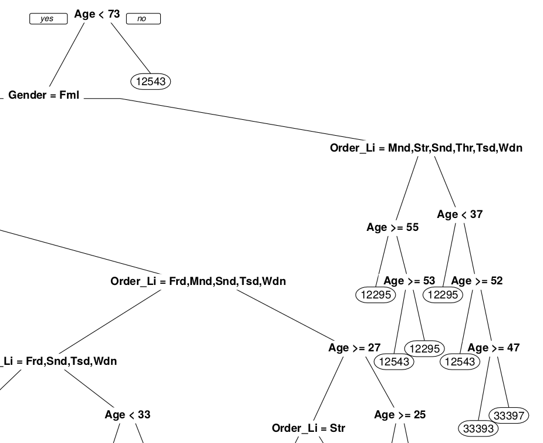

```{r setRngSeed, echo=FALSE}
# To always get (and report) the same cross-validation results (and any
# other random-based things) we initialize the RNG with a fixed seed:
set.seed(26769)
```

# Introduction
```{r includes01, echo=FALSE, message=FALSE, warning=FALSE}
library(dplyr)
library(ggplot2)
library(tidyr)
library(tidyverse)
library(knitr)
library(kableExtra)
library(usmap)
library(ineq)
library(janitor)
library(stringr)
library(car)
library(caret)
library(rpart)
library(rpart.plot)
```

## Our Approach
In this report we analysed the data of Ebuy, an online sales platform. We used the systematic approach from @wickhamGrolemund2017 of importing, tidying, exploring (transform, visualise, model), and communicating (figure \@ref(fig:wickham2017Explor)) for a data set provided by Ebuy itself.

```{r wickham2017Explor, echo=FALSE, fig.cap="Grolemund and Wickham (2017): Data Exploration", fig.align = 'center'}
include_graphics("images/wickham2017-data-science-explore.png")
```

## The Data {#data-cleaning}
Ebuy's data came separated into different files: files that contained the actual observations and files that described the columns. We first joined the column names with their respective data sets and after examining the data we than proceeded to clean them. This included eliminating empty rows and columns, as well as renaming and forcing some of the variables to be categorical. To get as much knowlegde out of the data as possible we tried to combine the order data with the clickstream data. Unfortunately there was no way to merge the two files thats why we could only analyze the files separately.
```{r unzipClickstream1, echo=FALSE, message=FALSE}
# The first part of the clickstream data comes in a ZIP archive. We have to unzip it first.
# This was done in 'src/data/script_01_unzip_data.sh' before. Its now part of this "big markdown file".

unzip("../data/raw/clickstream/clickstream_data.zip", exdir=".")
# Extracting to "../data/interim/clickstream/" works fine under Linux, but not under Windows (even
# within a cygwin/gitbash shell)! Extracting to "." is ugly but gets the job done.
```

```{r loadingTheData, echo=FALSE, message=FALSE}

# README: This code chunk used to reside in 'src/data/script_02_join_data_with_column_names.r'! Its now part of
# the "big markdown file". There also is a corresponding Python script 'src/data/script_02_join_data_with_column_names.py'
# that does the same thing but is not featured in this report!

readdatawithcolumns <- function(headersFile, dataFile) {
    message("Reading headers...")
    tmpHeaderNames <- read.csv(file=headersFile, sep=":", header=FALSE)
    headerNames <- tmpHeaderNames$V1

    message("Replacing spaces...")
    headerNames <- gsub(" ", "_", headerNames)

    message("Adding headers to data file...")
    df <- read.csv(file=dataFile, sep=",", header=FALSE)
    colnames(df) <- headerNames
    return(df)
}

# read the ORDER data:
orderDf <- readdatawithcolumns(headersFile="../data/raw/orders/order_columns.txt",
                               dataFile="../data/raw/orders/order_data.csv")
write.csv(orderDf, file="../data/interim/orders/orders_with_headers.csv", row.names=FALSE)

# read the CLICKSTREAM:
clickstreamDf1 <- readdatawithcolumns(headersFile="../data/raw/clickstream/clickstream_columns.txt",
                                      dataFile="./clickstream_data.csv")
clickstreamDf2 <- readdatawithcolumns(headersFile="../data/raw/clickstream/clickstream_columns.txt",
                                      dataFile="../data/raw/clickstream/clickstream_data_part_2.csv")
clickstreamDf <- rbind(clickstreamDf1, clickstreamDf2)
write.csv(clickstreamDf, file="../data/interim/clickstream/clickstream_with_headers.csv", row.names=FALSE)
```

```{r cleaningTheData, echo=FALSE, message=FALSE}

# README: This code chunk used to reside in 'src/data/script_03_clean_data.r'! Its now part of the "big markdown file".
#There also is a corresponding Python script 'src/data/script_03_clean_data.py'
# that does the same thing but is not featured in this report!

cleanFile <- function(filePath, threshold, keepColumns) {
  message(sprintf("Loading file from %s.", filePath))
  df <- read.csv(file=filePath, header=TRUE, na.strings = c("?", "NA", "NULL"))

  message("Cleaning data.")
  message("1. Removing empty rows and columns.")
  dfCleaned <- remove_empty(dat = df, which = c("rows", "cols"))
  columnsDeleted <- ncol(df) - ncol(dfCleaned)
  message(sprintf("1. Removed %d columns", columnsDeleted))

  message("2. Removing constant columns.")
  dfCleaned <- remove_constant(dat = dfCleaned, na.rm = TRUE)
  columnsDeleted <- ncol(df) - ncol(dfCleaned) - columnsDeleted
  message(sprintf("2. Removed %d columns", columnsDeleted))

  message(sprintf("3. Removing columns with unknown values (threshold = %f).", threshold))
  deletableColumns <- list()
  for(c in 1:ncol(dfCleaned)){
    currentColumn <- dfCleaned[,c]
    unknownPercentage <- sum(is.na(currentColumn))/length(currentColumn)
    if(colnames(dfCleaned)[c] %in% keepColumns){
      next
    }
    if(unknownPercentage >= threshold){
      deletableColumns <- c(deletableColumns, colnames(dfCleaned)[c])
    }
  }

  columnsDeleted <- length(deletableColumns)
  message(sprintf("3. Removed %d columns", columnsDeleted))

  dfCleaned <- dfCleaned[, !(names(dfCleaned) %in% deletableColumns)]

  message(sprintf("File cleaned. Total deleted columns: %d", ncol(df)-ncol(dfCleaned)))
  return(dfCleaned)
}

clickstream_data <- cleanFile("../data/interim/clickstream/clickstream_with_headers.csv", 0.85, c("US_State", "Customer_ID"))
orderDfCleaned <- cleanFile("../data/interim/orders/orders_with_headers.csv", 0.85, c())

# README: There is both an R ('src/data/script_004_join_data_sets.r') as well as a Python script
# ('src/data/script_004_join_data_sets.py') for joining the two data sets. Unfourtunately, joining
# didn't work - there simly was not a single matching tuple!
```

```{r pickColumnsForceCat01, echo=FALSE}
orderDfCleaned$Product_Family_ID <- as.factor(orderDfCleaned$Product_Family_ID)
orderDfCleaned$Order_Line_Day_of_Week <- as.factor(orderDfCleaned$Order_Line_Day_of_Week)
orderDfCleaned$Order_Line_Hour_of_Day <- as.factor(orderDfCleaned$Order_Line_Hour_of_Day)
orderDfCleaned$Gender <- as.factor(orderDfCleaned$Gender)
orderDfCleaned$US_State <- as.factor(orderDfCleaned$US_State)
orderDfCleaned$Age <- as.numeric(orderDfCleaned$Age)
```

## What we have done

In our analysis of Ebuy's data we distiguised between different scopes of interest. You could also define these scopes as different views on the data. Namely we distinguished between the customers, the orders and the clicks. Each of these topics raises a lot of interesting questions which we tried to answer with your data as foundation. In [chapter 2](#summary-statistics) we first took a broad overview of what might be interesting in the data and raised some early hypotheses on how to improve Ebuy's business with that knowledge. We then analyzed the data in more depth and highlighted some very interesting observations in [chapter 3](#plots) which was all about visualization. For instance we looked at which states in the US generate the most traffic on your website, what the most popular brands on Ebuy are and which day of the week comes with the most orders. In [chapter 4](#ebuys-experiment) we then looked at the performance data of the three recommender systems you sent us some weeks ago. We came to the conclusion that one of the recommender systems is significantly better than the random recommender system while the other showed a very weak performance. Futhermore in [chapter 5](#models-and-predicitons) we tried to predict what a customer will buy based on some characteristics such as age and gender.

# Summary Statistics {#summary-statistics}
## Clicks

The data period contained data for 17 days. To get an overview over the clickstream data, we looked at different measures in the data. The table below shows how many sessions and requests Ebuy's web site accumulated per day. The last measure is the average requests per session which made it easier to compare the session length between days. Apparently, the data sampling started on April 14th, 2000 in the late evening because there were only 37 requests in five sessions, while every other day generated at least 6800 requests.
Also, there were no clear correlations between the day of the week and the session length, but there seemed to be a correlation between the day of the week and session count. On weekends, there were less sessions and requests than during workdays. Whether this correlation is significant could be investigated by deeper analysis.

```{r requestsummary, echo=FALSE}

clickstream_data %>%
  group_by(Request_Date) %>%
  summarise(Day = first(REQUEST_DAY_OF_WEEK), Sessions = n_distinct(Session_ID), Requests = n(), "Requests per Session" = Requests/Sessions) %>%
  rename(Date = Request_Date) %>%
  kable() %>%
  kable_styling(full_width=FALSE)

```

After we found out when and how long visitors browsed on Ebuy's web site, we wanted to know what products they looked at. Because of the large set of products, we only looked at the top 10 products of Ebuy's assortment. Since the clickstream data did not provide information about the product names, we had to choose the product ID. The "Views per Session" measure showed how often the product was viewed in each session in which the product site was visited. By far the most prevalent product was the product with ID 10315. It is also the product with the least views per session, which means that it is relatively also viewed in the most sessions. Thus, it was truly the most popular product in the clickstream data. Also, it accumulated more than twice as many requests as the product with ID 12483, which is the sixth most viewed product. That shows how large the difference was even between the top products.

```{r productrequests, echo=FALSE}

clickstream_data %>%
  group_by(Product_ID) %>%
  summarise(Requests = n(), Sessions = n_distinct(Session_ID), Views_Per_Session = Requests/Sessions) %>%
  arrange(desc(Requests)) %>%
  filter(!is.na(Product_ID)) %>%
  top_n(wt = Requests, n=10) %>%
  rename("Product ID" = Product_ID, "Views per Session" = Views_Per_Session) %>%
  kable() %>%
  kable_styling(full_width=FALSE)


```

Another perspective on the clickstream data was the customer. The question was which customers were the most regular visitors of the Ebuy web site and how long they stayed on the site. The information had to be evaluated with caution, because the data only listed customers that were logged into the web site. The customer with the most requests had the customer ID 5224 with 247 requests over the data period. Also, customer 5224 had six sessions in the 17 days of data sampling, which means the customer visited the site about every third day. Within the top 10 customers, there were three customers with only one session and a high "pages per session" value.

```{r customerrequests, echo=FALSE}

clickstream_data %>%
  group_by(Customer_ID) %>%
  summarise(Requests = n(), Sessions = n_distinct(Session_ID), Pages = n()/n_distinct(Session_ID)) %>%
  arrange(desc(Requests)) %>%
  filter(!is.na(Customer_ID)) %>%
  top_n(wt = Requests, n=10) %>%
  rename("Customer ID" = Customer_ID, "Average pages per session" = Pages) %>%
  kable() %>%
  kable_styling(full_width=FALSE)

```


## Customers

It is always important to know who your customers are when conducting a business. Therefore we looked at some of the most apparent properties of your customers. First we looked on how old Ebuy's customers are. Your youngest customer is 18 years old while your oldest customer indeed is 98 years old. Although it is nice to see that there are some very old people who know how to operate a computer properly for Ebuy it is more intersting to see that your average customer is in his/her mid 30's. Maybe Ebuy should research what trends are emerging in this age segment so you can fit your offerings to your audience.

```{r ageDistro, echo = FALSE}
filtered = orderDfCleaned %>%
  na_if("?")  %>%
  distinct(Customer_ID, .keep_all = TRUE) %>%
  mutate(Age = as.numeric(as.character(Age))) %>%
  filter(!is.na(Age))

filtered %>% # start with data frame, and then ...
    summarize_at(
      .vars = c("Age"), # select variables that should be in the table
      .funs = tibble::lst(min, max, mean, median, sd) # which summary statistics do you want?
    )  %>%
    gather(Statistic, Value) %>% # transpose everything, and then ...
    kable() %>%
    kable_styling(full_width=FALSE)

```

When looking at the gender distribution in your customer base it is interesting to observe that most of your customers are women. Maybe Ebuy should consider putting some marketing in place to attract more men to the platform or fully commit to only sell products for women.

```{r genderDistro, echo = FALSE}
orderDfCleaned %>%  
  na_if("NULL")  %>%
  distinct(Customer_ID, .keep_all = TRUE) %>%
  filter(!is.na(Gender)) %>%
  group_by(Gender) %>%
  summarise(Count = n()) %>%
  kable() %>%
  kable_styling(full_width=FALSE)

```

Furthermore we was interested into how people get to know about Ebuy and it turns out that most of Ebuy's customers got aware of Ebuy through they friends and family in the first place. It seems like Ebuy is really dependent on mouth to mouth propaganda. E-mail advertisements are also working quite fine in generating new leads, whereas only a fraction of customers got interested into Ebuy via print ads. Maybe Ebuy should look closer into social media marketing and other types of modern marketing mechanisms if you want to get more independent from mouth to mouth propaganda which is hard to control although it is working fine for now.

```{r howDidYouHearAboutUs, echo = FALSE}
orderDfCleaned %>%  
  na_if("?")  %>%
  distinct(Customer_ID, .keep_all = TRUE) %>%
  filter(!is.na(HowDidYouHearAboutUs)) %>%
  group_by(HowDidYouHearAboutUs) %>%
  summarise(Count = n()) %>%
  arrange(desc(Count)) %>%
  kable() %>%
  kable_styling(full_width=FALSE)

```

We also tried to get insight about how many of your customers are parents. If the share is high maybe it makes sense to also offer products for babies and young children since parents buy the clothing for their kinds until a specific age of the children. Maybe parents will just put a new pyjama for their kid in the basket while shopping a new dress for themselve. It turns out that indeed approximatively 40% of your  customers are parents.

```{r presenceOfChildren, echo = FALSE}
orderDfCleaned %>%
  na_if("?") %>%
  distinct(Customer_ID, .keep_all = TRUE) %>%
  filter(!is.na(Presence_Of_Children)) %>%
  group_by(Presence_Of_Children) %>%
  summarise(Count = n()) %>%
  kable(col.names = c("Presence of Children", "Count")) %>%
  kable_styling(full_width=FALSE)

```

## Orders {#products-summary}
For Ebuy it should be interesting to find out, which of their products and product families are the ones that sell best. The best selling product is a pair of socks from brand HOSO, their best selling product family has the ID 12295. Unfortunately the data does not provide any meaningful further details, what this product family is made of.

```{r mostOrderedProductsAndProductFamilies, echo=FALSE}
findDistinctBrandname <- function(dataFrame, productId) {
  bn <- dataFrame %>%
    filter(Product_ID == productId) %>%
    select(BrandName) %>%
    distinct(BrandName) %>%
    slice(1:1)
  return(bn$BrandName)
}

orderDfCleaned %>%
  select(Product_ID, BrandName) %>%
  drop_na(Product_ID) %>%
  count(Product_ID) %>%
  arrange(desc(n)) %>%
  rowwise() %>%
  mutate(
    brandName = findDistinctBrandname(orderDfCleaned, Product_ID)
  ) %>%
  rename("Product ID"=Product_ID, "Brand Name"=brandName, "Total Sales"=n) %>%
  slice(1:5) %>%
  kable(.) %>%
  kable_styling(full_width=FALSE)

orderDfCleaned %>%
  drop_na(Product_Family_ID) %>%
  count(Product_Family_ID) %>%
  arrange(desc(n)) %>%
  rename("Product Family ID"=Product_Family_ID, "Total Sales"=n) %>%
  slice(1:5) %>%
  kable(.) %>%
  kable_styling(full_width=FALSE)
```

When reasoning about what price tags to put on items in the future, Ebuy should take a look at what its customers are willing to pay today. Calculating the usual statistics for the two different types of order amounts stored in Ebuy's data we find an average order total between 6\$ and 25\$.
```{r orderTotals, echo=FALSE}
orderDfCleaned %>%
  select(
    "Order_Amount",
    "Order_Line_Amount"
  ) %>%
  rename(
    "Order Amount" = Order_Amount,
    "Order Line Amount" = Order_Line_Amount
  ) %>%
  summarise_all(list(Min=min, Max=max, Median=median, Mean=mean), na.rm=TRUE) %>%
  gather(key, value) %>%
  separate(col=key, sep="_", c("Order Amount Type", "stat")) %>%
  spread(key=stat, value=value) %>%
  kable() %>%
  kable_styling(full_width=FALSE)
```

# Plots {#plots}
## Clicks
### How are the requests distributed geographically?

Since all available clickstream data showed requests from the US market, it was interesting to see how visitors from different US states behaved on the web site. Figure \@ref(fig:heatmap) shows how many requests per US state have been recorded in the data time span. While the information of the figure is extremely useful, it has to be noted that `r format(round(100*sum(is.na(clickstream_data$US_State))/length(clickstream_data$US_State), 2), nsmall = 2)`% of the observations in the clickstream data did not include information about the state of the visitor. Still, `r sum(!is.na(clickstream_data$US_State))` entries contained the US state, making the plot meaningful.

```{r heatmap, echo=FALSE, fig.cap="Heatmap of requests per US state", warning=FALSE, fig.align = 'center'}


map_data <- clickstream_data %>%
  select(US_State) %>%
  group_by(US_State) %>%
  summarise(Request_Count = n(), state = first(US_State))

plot_usmap(data = map_data, values = "Request_Count", labels = TRUE) +
  scale_fill_continuous(low = "white", high = "red", name = "Request Count") +
  labs(title = "How many requests come from each US state?") +
  theme(plot.title = element_text(face = "bold", size = 15, hjust = 0.5),
        plot.subtitle = element_text(hjust = 0.5, size = 12, face = "italic"),
        legend.position = "bottom", legend.justification = "center",
        legend.background = element_blank())

```

First of all, it stood out that there was no recorded data for Wyoming and Vermont. Although it is very likely that there were unrecorded requests from these states, we cannot make assumptions or predictions for the states on this basis.
For the other states however, the plot could be used to draw conclusions.
The states with the most requests were New York (2926 requests), California (2892 requests) and Texas (1467 requests). Compared to the average of `r format(round(mean(map_data$Request_Count[!is.na(map_data$state)]), 2), nsmall = 2)` requests per state, these three states were overproportionally represented. Reasons for this high number of requests could be that this states were the states with the highest Gross Domestic Product (GDP) in the year 2000 ([U.S. Bureau of Economic Analysis](https://apps.bea.gov/iTable/iTable.cfm?reqid=70&step=30&isuri=1&major_area=0&area=01000,02000,04000,05000,06000,08000,09000,10000,11000,12000,13000,15000,16000,17000,18000,19000,20000,21000,22000,23000,24000,25000,26000,27000,28000,29000,30000,31000,32000,33000,34000,35000,36000,37000,38000,39000,40000,41000,42000,44000,45000,46000,47000,48000,49000,50000,51000,53000,54000,55000,56000,91000&year=2000&tableid=505&category=1505&area_type=0&year_end=-1&classification=naics&state=0&statistic=1&yearbegin=-1&unit_of_measure=levels)).
The implications for Ebuy are to especially target visitors from New York, California and Texas to generate profit from the high ratio of visitors coming from these states. Targeting methods could include special offers or extensive marketing.

```{r createRequestData, echo=FALSE}
data_requests_products <- clickstream_data %>%
  select(Product_ID) %>%
  filter(Product_ID != "?") %>%
  group_by(Product_ID) %>%
  summarise(Request_Count = n())

```

### How many times was each product accessed?

Another important information was which products were viewed most often. Figure \@ref(fig:requests) shows the distribution of requests per product. Although there were too many products to show the individual number of requests per product, it becomes clear that the requests were not equally distributed. The distribution has the form of a long-tail curve, meaning that a small portion of all products got a large proportion of the requests. The implications for Ebuy are that not all products can be treated equally. Ebuy should focus their marketing activities on products that are viewed more often in order to generate more profit. The most viewed product has product ID `r data_requests_products[order(data_requests_products$Request_Count, decreasing = TRUE),][1,1]` and was visited 691 times. Compared with the IDs of the most bought products in \@ref(products-summary), it became apparent that the most viewed product was not the most bought one. Since it was the most viewed product, it had to be interesting for potential customers. Ebuy should investigate what kept customers from buying that product because they were missing out on profit. Possible reasons for that could be that the price was too high and that customers could buy an equal product cheaper somewhere else, or that the presentation of the product on the web site was not appealing enough to convince visitors to buy it.

```{r requests, echo = FALSE, fig.cap="Requests per product", fig.align = 'center'}

ggplot(data_requests_products) +
  geom_line(aes(x = reorder(Product_ID, desc(Request_Count)), y = Request_Count, group = 1)) +
  labs(x = "Products", y = "Requests")  +
  theme_classic() +
  theme(axis.text.x = element_blank(), axis.ticks.x = element_blank(),
        plot.title = element_text(hjust = 0.5), plot.subtitle = element_text(hjust = 0.5)) +
  scale_y_continuous(expand = c(0,0))

```

### How long do customers stay on the Ebuy web site?

To analyze how the average session on the Ebuy web site looks like, we looked at the length of the session in two different ways: The first variable was the number of different pages visited during a single session. The second variable was the time between the first and the last request of the session. The scatterplot in figure \@ref(fig:sessionduration) shows how the sessions were distributed regarding the previously mentioned dimensions.
The first observation was that generally speaking the average session duration in seconds increased with an increasing number of pages visited. This finding was expected for normal online shopping behavior. However, the average session duration became more scattered with higher pages visited. This can be explained with the fact that a smaller proportion of sessions showed a high amount of pages visited, making outliers more impactful to the average than in the data points with small numbers of visited pages.
The second observation was that most visitors looked at less than ten pages in a session. That showed that only a few visitors used Ebuy's web site to browse through different available products. Most visitors seem to have had a clear goal when entering the site and only looked at the product (and maybe a few alternative products) and then decided whether they buy that product or not. Ebuy could use improved advertisement (e.g. features like "Customers who bought this product also bought that product") to convince visitors to stay on their web site for longer and thus be more likely to buy more than one product.
The previous finding could also indicate that there were many regular customers who always bought the same product and thus only stayed on the web site for a short period of time since they knew what product they wanted.

```{r sessionduration, echo=FALSE, fig.cap="Scatterplot of session characteristics", fig.align = 'center'}
  duration_data <- clickstream_data %>%
  select(Session_ID, Request_Sequence, Request_Date, Request_Date_Time, Session_First_Request_Date, Session_First_Request_Date_Time) %>%
  unite(col = "Request_Timestamp",c("Request_Date", "Request_Date_Time"), sep = " ", remove = TRUE) %>%
  unite(col="Session_First_Request_Timestamp", c("Session_First_Request_Date","Session_First_Request_Date_Time"), sep=" ", remove=TRUE) %>%
  mutate(Request_Timestamp = as.POSIXct(Request_Timestamp, format="%Y-%m-%d %H\\:%M\\:%S")) %>%
  mutate(Session_First_Request_Timestamp = as.POSIXct(Session_First_Request_Timestamp, format="%Y-%m-%d %H\\:%M\\:%S")) %>%
  group_by(Session_ID) %>%
  summarise(Pages_Visited=n(),Session_First_Request=min(Session_First_Request_Timestamp),Session_Last_Request=max(Request_Timestamp)) %>%
  mutate(Session_Duration = as.numeric(difftime(Session_Last_Request, Session_First_Request,units = "secs",))) %>%
  group_by(Pages_Visited) %>%
  summarise(avg_Session_Duration = mean(Session_Duration), Session_Count = n_distinct(Session_ID)) %>%
  filter(Session_Count > 2 & Pages_Visited > 1)

  ggplot(data = duration_data) +
  geom_point(aes(x = Pages_Visited, y = avg_Session_Duration, size = Session_Count)) +
  labs(x = "Pages Visited", y = "Average Session Duration (seconds)", size = "Sessions") +
  theme(plot.title = element_text(hjust = 0.5), plot.subtitle = element_text(hjust = 0.5))
```

## Customers

### How is the sales volume distributed among customers?

We wanted to know if there is maybe a little group of customers which is responsible for large parts of the overall spendings on Ebuy. If this is the case it is probably important to focus on such a group as they are generating most of your revenue. Therefore we looked at how the spendings on Ebuy are distributed among the customers. The lorenz curve in figure \@ref(fig:calculateMoneySpendPerCustomer) vizualizes this distribution.
As you can see the curve shows that the distribution of sales is not equally distributed among the customers. The curve's gini coefficient has a value of 0.46 indicating an very unequal distribution. Interestingly the upper ten percent of customers are responsible for approximately 42% of total sales. This tells us that indeed there is a  customer group which spends much more on Ebuy than the remaining majority. We suggest that Ebuy should look take attention on this group and foster their willingness to spend money on Ebuy, maybe with exclusive offerings for royality customers.

```{r calculateMoneySpendPerCustomer, echo=FALSE, fig.cap="Lorenz Curve - Customer Spendings", fig.align = 'center'}
money_spent_per_customer <- orderDfCleaned %>%
  group_by(Customer_ID) %>%
  summarise(Total_Spending = sum(Order_Line_Amount))

lorenz_money_spent_per_customer <- Lc(money_spent_per_customer$Total_Spending)
lorenz_money_spent_per_customer_df <- data.frame(p=lorenz_money_spent_per_customer$p, L=lorenz_money_spent_per_customer$L)

ggplot(data=lorenz_money_spent_per_customer_df) +
  geom_line(aes(x=p, y=L)) +
  scale_x_continuous(name="Cumulative share of Customers", limits=c(0,1)) +
  scale_y_continuous(name="Cumulative share of Spendings", limits=c(0,1)) +
  geom_abline(color = "grey")
```

In the table below we looked at who exactly are your ten most profitable customers. The customer with ID 30208 is by far your most profitable customer having spend approximately twice as much money than thesecond most profitable customer with ID 29244. Ebuy should probably reward some of it's most spending customers to keep those customers active on the platform. It is intersting to see how the average price per item depends between the different customers ranging from an minimum of \$6 to a maximum of \$36 on average per item. Ebuy could utilize this knowledge to recommend customers with an high average price per item more costly items while showing more cheaper items to those customers who have spent less per item in the past.  

```{r mostSpendingCustomersTable, echo=FALSE}
orderDfCleaned %>%
  group_by(Customer_ID) %>%
  summarise(Total_Spendings = sum(Order_Line_Amount), Total_Item_Count = sum(Order_Line_Quantity), Average_Price_Per_Item = Total_Spendings/Total_Item_Count) %>%
  arrange(desc(Total_Spendings)) %>%
  head(10) %>%
  kable() %>%
  kable_styling(full_width = FALSE)
```

### How are customer spendings distributed among the different brands?

We also looked into whether people are spending their money equally for all brands or if spendings are focussed on a particular group of brands. The lorenz curve in figure \@ref(fig:lorenzBrandToSales) has a gini coefficient of 0.36 indicating a quite inequal distribution of sales to the respective brands. The upper 10 percent of brands are responsible for approximately 28% of generated sales while the lower 50 percent of the brands are only responsible for 21% of sales. Maybe Ebuy should consider to boost some of the very successful brands because people tend to buy more of it. Ebuy could show new customers products of one of the successful brands when they first visit the Ebuy page because they will more likely buy it which will in turn increase sales. In the following we will look into which are the most successful brands for men and women.

```{r lorenzBrandToSales, echo = FALSE, fig.cap="Lorenz Curve - Brand Spendings", fig.align = 'center'}
orders_with_brand <- orderDfCleaned
orders_with_brand$Brand = unlist(lapply(orderDfCleaned$Product_Level_2_Path, FUN = function(path){return(str_match(path, "\\/.*\\/.*\\/(.*)")[,2])}))

money_spent_per_brand <- orders_with_brand %>%
  group_by(Brand) %>%
  summarise(Total_Spending = mean(Order_Line_Amount))


lorenz_money_spent_per_brand <- Lc(money_spent_per_brand$Total_Spending)

lorenz_money_spent_per_brand_df <- data.frame(p=lorenz_money_spent_per_brand$p, L=lorenz_money_spent_per_brand$L)

ggplot(data=lorenz_money_spent_per_brand_df) +
  geom_line(aes(x=p, y=L)) +
  scale_x_continuous(name="Cumulative share of Brands", limits=c(0,1)) +
  scale_y_continuous(name="Cumulative share of Spendings", limits=c(0,1)) +
  geom_abline(color = "grey")
```

### What are the most popular brands for men and women?

```{r include=FALSE}
orders = orderDfCleaned %>%
  select(Customer_ID, Order_Line_Session_ID, Order_ID, Customer_ID,
         Age, Gender, Product_Level_2_Path, Order_Status, Order_Line_Quantity)
orders$Brand = unlist(lapply(orders$Product_Level_2_Path, FUN = function(path){return(str_match(path, "\\/.*\\/.*\\/(.*)")[,2])}))
```

To get an overview over what brands your customers like the most we vizualized the popularity of the brands based on how many articles was bought from the brand. Hanes and American Essentials are the most popular brands among Ebuy's female customers (compare figure \@ref(fig:brandsFemale)). Interestingly those are also the two most successful brands for men as you can see in figure \@ref(fig:brandsMale)) although men bought products from American Essential twice as often as from Hanes.

```{r prepareBrandData, include= FALSE}
mostPopularFemaleBrands = orders %>%
  filter(Gender == "Female") %>%
  filter(!is.na(Brand)) %>%
  group_by(Brand) %>%
  summarise(Order_Amount = sum(Order_Line_Quantity)) %>%
  arrange(desc(Order_Amount)) %>%
  head(10)
```

```{r brandsFemale, echo=FALSE, fig.cap= "Most Popular Brands for Females (based on cumulated order amount)", fig.align = 'center'}
ggplot(mostPopularFemaleBrands, mapping = aes(x = reorder(Brand, Order_Amount), y = Order_Amount)) +
  geom_bar(stat = "identity") +
  coord_flip() +
  labs(x = "Brand", y = "Order Amount")
```

```{r include=FALSE}
mostPopularMaleBrands = orders %>%
  filter(Gender == "Male") %>%
  filter(!is.na(Brand)) %>%
  group_by(Brand) %>%
  summarise(Order_Amount = sum(Order_Line_Quantity)) %>%
  arrange(desc(Order_Amount)) %>%
  head(10)
```

```{r brandsMale, echo=FALSE, fig.cap="Most Popular Brands for Males (based on cumulated order amount)", fig.align = 'center'}
ggplot(mostPopularMaleBrands, mapping = aes(x = reorder(Brand, Order_Amount), y = Order_Amount)) +
  geom_bar(stat = "identity") +
  coord_flip() +
  labs(x = "Brand", y = "Number of Purchases")
```

## Orders
### Different order volumes on different days of the week?
Orders at Ebuy's online shop might be distributed differently among the different days of the week. To examine, whether this is the case, we plotted a frequency distribution of all orders over the days of week. We first reordered the days in the canonical way (i.e. Monday, Tuesday, Wednesday, ...) and then counted and plotted the order frequencies against them (figure \@ref(fig:orderDayBarPlot1)). Clearly, the most orders are placed during the weekdays (peaking on Wednesdays), the least orders on sunday. In order to ramp up their sales on those days where sales are particulary low (Saturday, Sunday, Monday), Ebuy could for instance try to hand out (digital) coupons that are only valid on the weekend, thereby hopefully increasing their sales figures.
```{r orderDayBarPlot1, echo=FALSE, fig.cap="Distribution of orders among different days of the week", fig.align = 'center'}
orderDfCleaned %>%
  mutate(
    Order_Day_of_Week = factor(Order_Day_of_Week, levels=c(
      "Monday",
      "Tuesday",
      "Wednesday",
      "Thursday",
      "Friday",
      "Saturday",
      "Sunday"))
    ) %>%
  count(Order_Day_of_Week) %>%
  slice(1:7) %>%
  ggplot(data = .) +
    geom_bar(mapping = aes(x = Order_Day_of_Week, y = n), stat = "identity") +
    labs(x = "Day of Week", y = "Order Volume")
```

### What is the distribution of order amounts?
For an online shop like Ebuy it might be of interest to identify those customers that place the vast majority of all orders. In order to visualize the distribution of order amounts we computed their Lorenz curve and plotted the cummulative percentages (figure \@ref(fig:orderTotalLc)). The curve shows a highly inequal distribution of order amounts: the lower 75% of all orders only account for roughly 25% of the total order amounts, while a quarter of all orders make up for three quarters of the sales total.
```{r orderTotalLc, echo=FALSE, fig.cap="Lorenz Curve: Distribution of order amounts", fig.align = 'center'}
lc <- Lc(orderDfCleaned$Order_Amount,
         n = rep(1, length(orderDfCleaned$Order_Amount)),
         plot = F)

p <- lc[1]
L <- lc[2]
lc <- data.frame(p,L)

ggplot(data = lc) +
  geom_line(aes(x = p, y = L)) +
  scale_y_continuous(name="% of order amounts", limits=c(0,1)) +
  scale_x_continuous(name="% of orders", limits=c(0,1)) +
  geom_abline()
```

# Ebuy's Experiment {#ebuys-experiment}
## Data and Summary Statistics
Ebuy's experiment provided us with data regarding different recommender systems. After loading and examining the dataset we picked all columns of interest (e.g. deciding to keep the first ID column only) and recoded the chosen ID column as a factor. We than calculated basic summary statistics, where the mean values where of most interest.
```{r loadexpdata, echo=FALSE}
experimentDf <- read.csv(file="../experiment/experimental_results.csv", sep=",", na.strings=c("NA"))
experimentDf <- experimentDf[c("id_", "ranking_based", "random_recommendations", "profit_oriented")]

names(experimentDf)[1] <- "id"
experimentDf$id <- as.factor(experimentDf$id)

experimentDf %>%
  select(
    "ranking_based",
    "random_recommendations",
    "profit_oriented"
  ) %>%
  rename(
    "Ranking-based" = ranking_based,
    "Random recommendations" = random_recommendations,
    "Profit-oriented" = profit_oriented
  ) %>%
  summarise_all(list(Min=min, Max=max, Median=median, Mean=mean), na.rm=TRUE) %>%
  gather(key, value) %>%
  separate(col=key, sep="_", c("Recommender system", "stat")) %>%
  spread(key=stat, value=value) %>%
  kable() %>%
  kable_styling(full_width=FALSE)
```

## Broad Overview of Distributions

When taking a broad look on the means and densities of the different recommender systems, you can clearly see that the profit-oriented recommender system has the highest mean sales with an average of \$21.75 per customer (see figure \@ref(fig:profitDensityAndMean)) in contrast to an average of  \$19 per customer for the ranking-based recommender (\@ref(fig:rankingDensityAndMean)) and \$18.50 for the random recommender (see figure \@ref(fig:randomDensityAndMean)). It is also worth to mention that the density for the profit-based recommender system is pretty narrow (compare figure  \@ref(fig:profitDensityAndMean)), indicating a lower standard deviation and probably a tighter confidence interval than the other two wider distributions for the ranking-based (see figure \@ref(fig:rankingDensityAndMean)) and the random recommender systems (see figure \@ref(fig:randomDensityAndMean)).

```{r recommenderSetup, include=FALSE}
recommender_to_sales <- setNames(data.frame(matrix(ncol = 3, nrow = 0)), c("Id", "Recommender", "Sales"))
index <- 1
for(row in 1:nrow(experimentDf)){
  if(!is.na(experimentDf[row, "ranking_based"])){
    recommender_to_sales[nrow(recommender_to_sales) +1,] = list(index, "ranking_based",
                                                                as.numeric(experimentDf[row, "ranking_based"]))
    index <- index+1
  }
  if(!is.na(experimentDf[row, "random_recommendations"])){
    recommender_to_sales[nrow(recommender_to_sales) +1,] = list(index, "random_recommendations",
                                                                as.numeric(experimentDf[row, "random_recommendations"]))
    index <- index+1
  }
  if(!is.na(experimentDf[row, "profit_oriented"])){
    recommender_to_sales[nrow(recommender_to_sales) +1,] = list(index, "profit_oriented",
                                                                as.numeric(experimentDf[row, "profit_oriented"]))
    index <- index+1
  }
}
recommender_to_sales$Id <- NULL
```

```{r rankingDensityAndMean, echo=FALSE, fig.cap="Ranking-Based Recommender - Sales Density and Mean", fig.align = 'center'}
ggplot(recommender_to_sales %>% filter(Recommender=="ranking_based"), aes(x=Sales)) +
  stat_density(geom="line") +
  geom_vline(aes(xintercept=mean(Sales)),color="black", linetype="dashed", size=1) +
  labs(x="Sales",y= "Density")
```

```{r profitDensityAndMean, echo=FALSE, fig.cap="Profit-Oriented Recommender - Sales Density and Mean", fig.align = 'center'}
ggplot(recommender_to_sales %>% filter(Recommender=="profit_oriented"), aes(x=Sales)) +
  stat_density(geom="line") +
  geom_vline(aes(xintercept=mean(Sales)),color="black", linetype="dashed", size=1) +
  labs(x="Sales",y= "Density")
```

```{r randomDensityAndMean, echo=FALSE, fig.cap="Random Recommender - Sales Density and Mean", fig.align = 'center'}
ggplot(recommender_to_sales %>% filter(Recommender=="random_recommendations"), aes(x=Sales)) +
  stat_density(geom="line") +
  geom_vline(aes(xintercept=mean(Sales)),color="black", linetype="dashed", size=1) +
  labs(x="Sales",y= "Density")
```

When taking a closer look at the confidence intervals of the different recommender systems (see figure \@ref(fig:confidenceIntervalsRecommenders)) you can clearly  see that the profit-based recommender systems shows the best performance and also has a very tight 95% confidence interval indicating high certainty in the amount of profit made from the recommender per customer. On the other side the confidence intervals for the profit-based recommender and the random recommender system are more wide and also overlap each other.

```{r confidenceIntervalsRecommenders, echo=FALSE, fig.cap="Recommender Confidence Intervals", fig.align = 'center'}
result <- group_by(recommender_to_sales, Recommender) %>%
  summarise(
    Count = n(),
    Mean = mean(Sales, na.rm = TRUE),
    Sd = sd(Sales, na.rm = TRUE),
    Se = Sd/sqrt(Count),
    CiMult = qt(0.975, Count-1),
    Ci = Se * CiMult
  )

# visualize CI
ggplot(result, aes(x=Recommender, y=Mean, group=1)) +
  geom_point(alpha=0.52) +
  geom_errorbar(width=.1, aes(ymin=Mean-Ci, ymax=Mean+Ci), colour="darkred") + labs(x="Recommender System",y= "Sales")
```

Therefore we should definitely do a statisitcal test to prove if the means of the different recommender systems are significantly different from each other or not.

## Shapiro-Wilk Normality Test

Before conducting a t-test to test if the profit means of the different recommender systems are significantly different from each other or not we will first check if their populations are normally distributed, which is a necessary precondition for conducting a t-test. In order to do so we used the Shapiro-Wilk normality test which tests the null-hypothesis that the population is normally distributed.

```{r echo = FALSE}
with(recommender_to_sales, shapiro.test(Sales[Recommender == "profit_oriented"]))
with(recommender_to_sales, shapiro.test(Sales[Recommender == "ranking_based"]))
with(recommender_to_sales, shapiro.test(Sales[Recommender == "random_recommendations"]))
```
It turns out that all the p-values are smaller than the significance level of 0.05 which means that we have to refuse the null-hypothesis which in turn implies that the distributions are not normally distributed. Therefore we used the Unpaired Two-Samples Wilcoxon Test (aka Mann-Whitney U Test) to test if the means of the different recommenders are equal or not. The Mann-Whitney U Test is an valid alternative to the t-test in szenarios in which the requirements for the t-test are not met and is widely used in practice.

## Mann-Whitney U Test

We first tested if there is a significant difference in the means of the random recommender system and the ranking-based recommender system. Our earlier observations of the confidence intervals of the two recommenders revealed that their confidence intervals are both quite wide and also overlap at large parts (see figure \@ref(fig:confidenceIntervalsRecommenders)). The test now proves that indeed the both means of the two recommender systems do not differ significantly (p = 0.2008 > 0.05).
Although the confidence intervals in figure \@ref(fig:confidenceIntervalsRecommenders) already indicate that the means of the profit-based recommender is significantly different from the random recommender system we conducted a test for that to be completely sure. The result of the test proves our suggestions with an p-value less than 0.001.

```{r echo = FALSE}
# perform wulxoc test
ranking_based_sales <- recommender_to_sales %>% filter(Recommender == "ranking_based")
profit_oriented_sales <- recommender_to_sales %>% filter(Recommender == "profit_oriented")
random_recommendations_sales <- recommender_to_sales %>% filter(Recommender == "random_recommendations")

wilcox.test(ranking_based_sales$Sales, random_recommendations_sales$Sales, alternative = "two.sided")
wilcox.test(profit_oriented_sales$Sales, random_recommendations_sales$Sales, alternative = "two.sided")
```

As the mean of the ranking-based recommender system has been shown to not differ significantly from the random recommendersystem we have to choose between the profit-oriented recommender system and the random recommender system. As the profit-oriented recommender systems mean value (21.75) is greater than the baseline mean (17.91), Ebuy should preferably use the profit-oriented one.

# Models and Prediction {#models-and-predicitons}
## Training the Model{#subsection-ttm}
As Ebuy's products fall into certain product families, we trained a model that allows to predict for a new customer from which product family he will purchase a product. We first grew a large tree with a complexity parameter of cp=0.00001 (i.e. splits had to decrease the lack of fit by a factor of 0.00001). We then examined the results of a 10-fold cross-validation by plotting the complexity parameter vs. its cross-validated error (as shown in figure \@ref(fig:cpplottree1)).
```{r cpplottree1, echo=FALSE, fig.cap="Product Family ID: Complexity parameter vs. cross-validated error", fig.align = 'center'}
tree <- rpart(Product_Family_ID ~ Order_Line_Day_of_Week + Gender + Age,
              method="class",
              data=orderDfCleaned,
              cp=0.00001)

plotcp(tree)
```

To prevent over-fitting, @kabacoff2015 suggests to choose the leftmost cp value below the dotted line (here: cp=0.0007): a tree of that size (here: 45 splits) is the smallest tree whose cross-validated error is whithin one standard error of the minimum cross-validated error value. We therefore pruned the tree to its new size and pretty-printed the resulting tree (figure \@ref(fig:prunedtree1)).
```{r prunedtree1, echo=FALSE, fig.cap="Product Family ID: Pruned Classification Tree", fig.align = 'center'}
prune(tree, cp=0.0007) %>%
  prp(., tweak = 1.5,)
```

The close up (figure \@ref(fig:tree1Zoom1)) gives a better idea of how a customers would be classified along the tree's splits: customers that are 73 years old or older will likely purchase a product from the category with the ID 12543; a male customer who purchases on any other day of the week than Friday and is younger than 37 will purchase from category 12295, etc. Section \@ref(subsection-pred) gives more detailed information on how such a prediction can be achieved computationally.
```{r tree1Zoom1, echo=FALSE, fig.cap="Partially Enlarged Classification Tree", fig.align = 'center'}
# The rpart package guesses (!) the font and line/node width and height based on your operation system's
# resolution. This might cause prp() to render an ugly plot. We've chosen a "tweak" factor of 1.5 which produces
# a reasonably good looking graphical representaion of our tree. We also added this "zoomed-in" screenshot that
# (as it is an image) does not change - no matter what your resolution/DPI is.

```


In order to create a linear regression model, that predicts the amount of money a customer would spend, we first computed scatterplot matrixes of different predictor variables. Most of the variables were not suitable for a linear model (see figure \@ref(fig:lmScatterMatrix1) for an example) and thus were discarded. We found (weak) visual correlations for the day of purchase, the customer's gender, the state he or she lives in, and the product family chosen from.
```{r lmScatterMatrix1, echo=FALSE, fig.cap="Scatter plot matrix for different (order-related) variables", fig.align = 'center'}
as.data.frame(orderDfCleaned[c("Order_Line_Amount",
                               "Order_Line_Day_of_Week",
                               "Order_Hour_of_Day",
                               "Age", "Gender",
                               "US_State", "Product_Family_ID")]) %>%
  scatterplotMatrix(.)
```

We then used these variables (day of purchase, the customer's gender, the state, and product family) in a repeated 10-fold cross-validated linear regression model. The resulting model has a mean absolute error of 4.4 on a scale from -40 to 234 with the actual mean value being 11.6 (see \@ref(products-summary)).
```{r linReg1, echo=FALSE, warning=FALSE}
ctrl <- trainControl(method = "cv",
                     number = 10,
                     repeats = 5)

linreg1 <- train(Order_Line_Amount ~ Order_Line_Day_of_Week + Gender + US_State + Product_Family_ID,
                 data = orderDfCleaned,
                 trControl = ctrl,
                 na.action  = na.pass,
                 method = "lm")
linreg1
# show the coefficients with: linreg1$finalModel
```


## Predictions{#subsection-pred}
Having trained the models in \@ref(subsection-ttm) Ebuy could predict the purchasing behaviour of future customers. Given such a previously unseen customer, Ebuy could for instance predict the product family which he is going to purchase from:
```{r prediction1}
# a fake order from a fake customer:
unseenCustomer <- data.frame(Order_Line_Day_of_Week = c("Thursday"),
                             Gender = c("Male"),
                             Age = c(23),
                             US_State = c("CO"))

# predict the product family:
predict(tree, unseenCustomer, type="class") %>%
  kable(col.names = c("Predicted product family")) %>%
  kable_styling(full_width=FALSE)
```

The predicted product family (12295) matches the one we did predict "manually" in \@ref(subsection-ttm). With the predictive power of such a decision tree Ebuy would be able to display product suggestions to its customers that will very likely match their taste.

Once Ebuy picked a product from the predicted product family to show their customer, they could also calculate a custom price. This could be done by utilizing the linear model computed before, calculating what price the given user would be willing to pay:
```{r prediction2, warning=FALSE}
# the same fake order/customer with the product family predicted above:
unseenCustomerWithPF <- data.frame(Order_Line_Day_of_Week = c("Thursday"),
                                   Gender = c("Male"),
                                   Age = c(23),
                                   US_State = c("CO"),
                                   Product_Family_ID = c("12295"))

# use the linear model to predict a price:
predict(linreg1, unseenCustomerWithPF, se.fit = TRUE) %>%
  kable(col.names = c("Predicted price (in $)")) %>%
  kable_styling(full_width=FALSE)
```
Based on the customer's data and the predicted product family Ebuy would set a price for the picked product of 7.98\$. Additional models, that of course can only be generated once there is a matching pair of 'Order' and 'Clickstream' data, could be used to for instance determine what product to pick from the predicted product family based on the user's clicks.


# Summary
Ebuy's data provided a welcome opportunity to take a data scientific look at real world data. Using the techniques learnt we could examine interesting phenomena and problems from such data.
In the [first part](#data-cleaning), we processed and cleaned the raw data, removing unneccessary columns and preparing the data for the analysis. In this step we also tried to merge the order data with the clickstream data because working with only one data set is more convenient and enables more ways to analyze the data. Since merging was not possible because of missing or incoherent data, we could only look at both data sets seperately.

In the [second part](#summary-statistics), we analyzed the data sets and created overviews over basic information that can be found inside of them. We found out that the requests, products and customers are very inequally distributed and that a small proportion of observations make up a high proportion of the whole set.
Afterwards, we analyzed the data in more detail, and created and discussed different plots. We found out that the US states New York, California and Texas generated the most traffic on Ebuy's web site. The different products accumulated very different numbers of requests and most customers stayed on the site for short sessions. Based on these findings, we advised Ebuy to target specific groups of customers/products with their marketing in order to increase their generated profit.
For customer data, we found that the top ten percent of customers are responsible for about 42% of Ebuy's profit. Implications of that are to make special offers for those customers to generate higher profit from their willingness to pay. Next, we looked at the distribution of brands and discovered that they also are distributed inequally. The top 10 percent of brands made up over a quarter of the total sales volume, making them fitting brands for advertisement. In further analysis we looked at the difference in brand popularity between men and women. For both genders, American Essentials and Hanes are by far the most popular brands but for women, Hanes is number one while for men, American Essentials is more popular.
Regarding the orders, we looked at the different order volumes between different days of the week. We found out that workdays are more successful than weekends, the most orders are placed on wednesdays and the least on sundays. Action potential raised by this could include coupons that are only valid on weekends to promote orders on these days.
Similarly to the analysis of the customer data, we were interested in the relative importance of orders. Thus, we looked at how much percent of orders make up which percentage of total sales and found out that the orders are highly inequally distributed. The lowest 75% of orders generate only a quarter of total sales, while the top 25% generate three quarters.

In the [third part](#ebuys-experiment), we used the provided data of Ebuy's experiment to analyse which of their recommender system generates the most profit. First, we cleaned the data and removed redundant ID columns. Then, we got an overview of the all systems by looking at the distribution and the mean of the generated sales. It became clear that the profit-based recommender had the highest mean (\$21.75) in comparison to the ranking-based (\$19) and random-based (\$18.50) recommenders.
Afterwards, we looked at the confidence intervals and saw that the profit-based recommender system had the best performance and also a tight 95% confidence interval, which indicates a high certainty in the expected sales per customer.
To find the statistically best performing recommender system, we performed a Shapiro-Wilk Normality Test and a Mann-Whitney U Test. The Shapiro-Wilk Normality Test showed that the data is not normally distributed. Then, we used the Mann-Whitney U Test which is widely used in practice and found out that the profit-based recommender system is significantly (p-value < 0.001) superior to the other systems.

In the [last part](#models-and-predictions), we used the order data to predict which product families a customer was most likely to purchase. We created a decision tree based on the characteristics Age, Gender, US State and Day of the week. Because of the large amount of product families the tree was also very large, but it can be used to predict what purchasing behavior a new customer with certain characteristics has. This model could help Ebuy to identify marketing potential and target specific groups of customers in a way that maximizes the generated profit. Building onto the tree-model, we created a linear regression model that predicted the order amount based on the Age, Gender, US State, Day of the week and Product Family. In combination with the decision tree, the linear regression model could predict the order amount based on basic customer data. That could be used by Ebuy in several ways, ranging from understanding their data and customers to facilitating custom pricing on their products.

Finally, we can say that the data was sufficient to draw conclusions and advise Ebuy for their further marketing actions. Due to the fact that the different data sets could not be connected because the order data was from january 2000 and the clickstream data was from april 2000, there was certainly a loss in analysis potential. If the data could be connected it would enable many ways to analyze the data further and answer questions like: Which browsing behavior leads to a purchase? How many clickstream sessions convert to purchases? How can the online shopping experience can be improved to generate more sales? Unfortunately this kind of analysis was not possible. Still, we found out a lot about the customer, the orders and the browsing behavior of potential customers. Concluding, this project was a success and gave a lot of insight into the data of Ebuy and showed clear implications for Ebuy. However, there is still improvement potential for the data. Coherent data would help to validate the findings and draw even more conclusions.

# Literature
